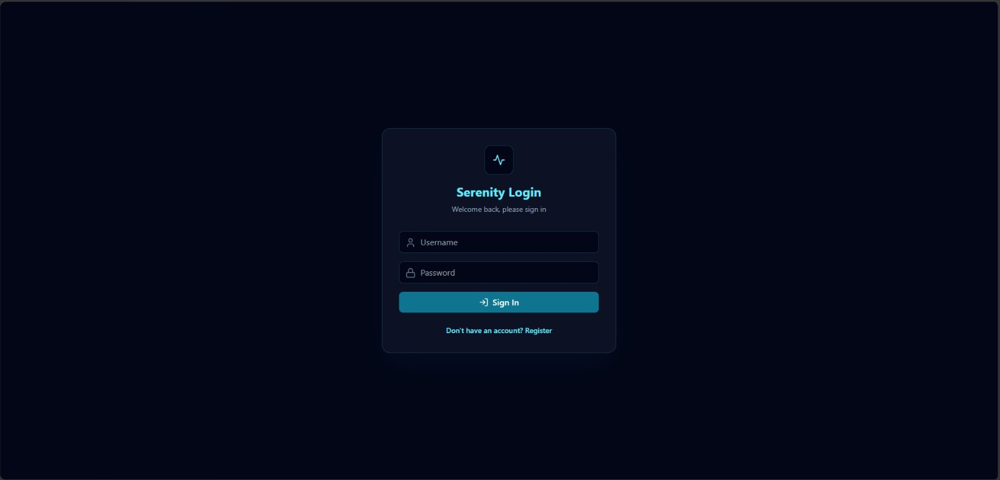
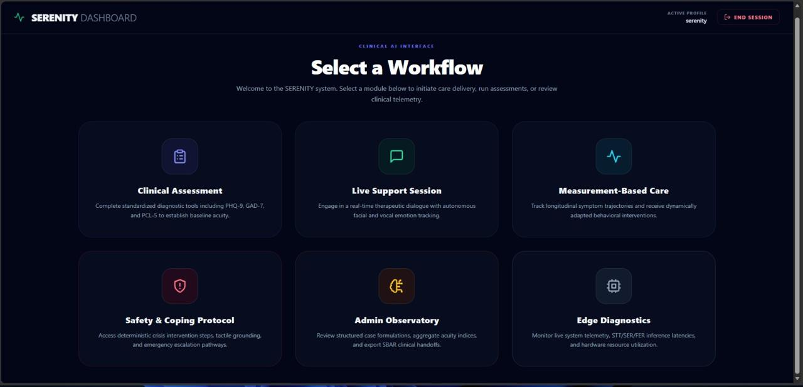
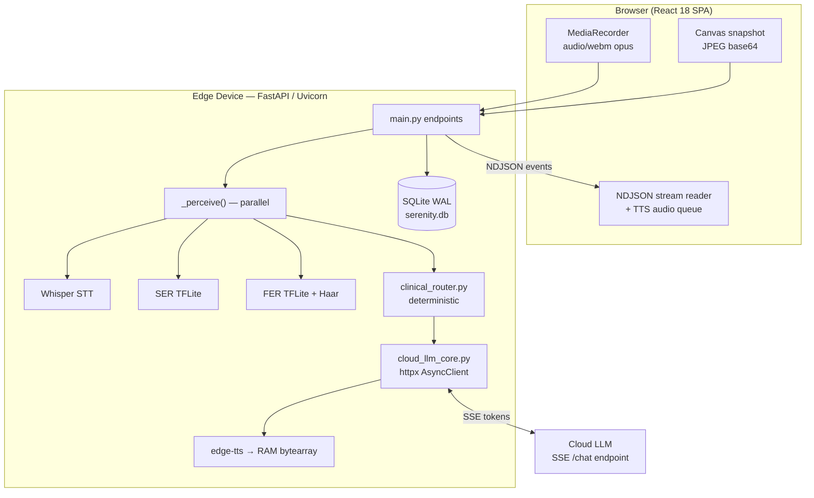
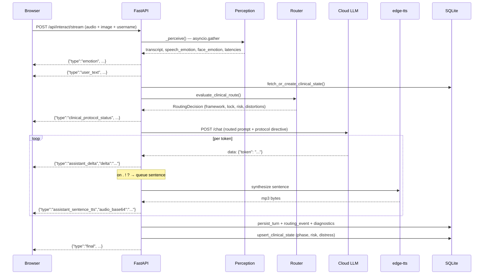
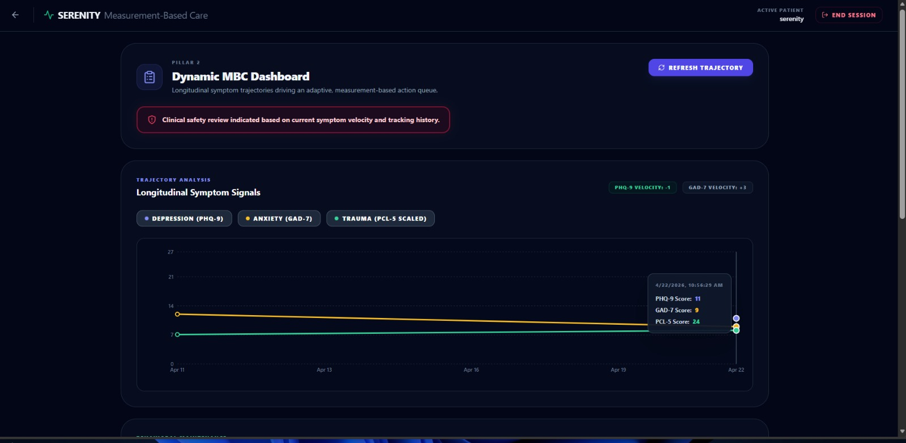
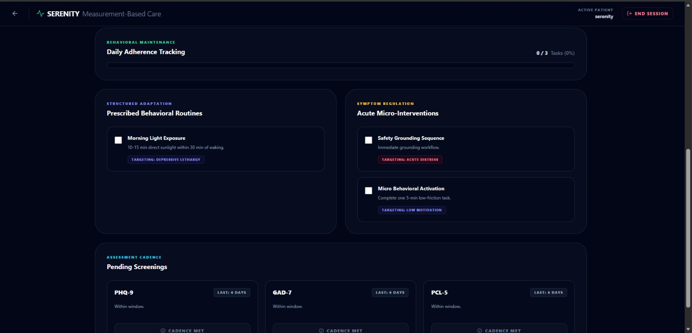
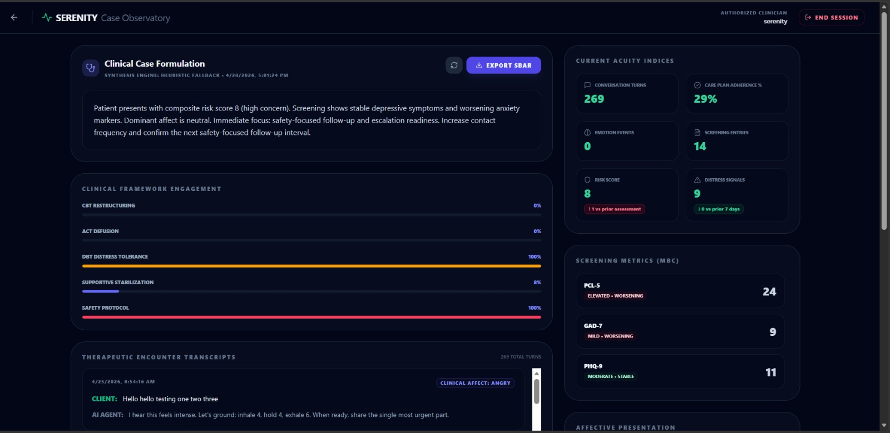
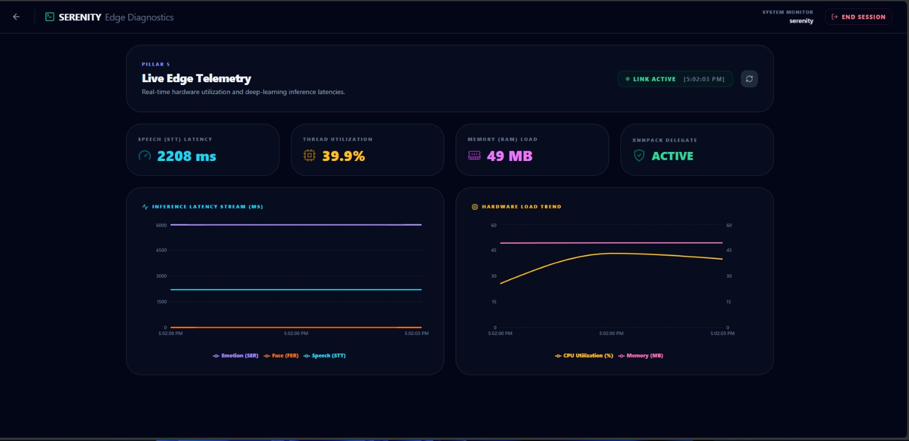

# SERENITY

**Smart Emotion Recognition and Neural Intervention Technology**

A multimodal, edge-deployable mental-health support system that fuses speech-to-text, speech emotion recognition, facial emotion recognition, standardized clinical screening (PHQ-9 / GAD-7 / PCL-5), deterministic psychotherapy-framework routing, and a streaming cloud LLM into a single clinician-observable platform.

> **Disclaimer:** SERENITY is an academic engineering prototype for support and observability. It is **not** a medical device, does **not** provide diagnosis, and must **not** be used as a substitute for professional clinical judgement or emergency services.

----


## Table of Contents

1. [What SERENITY Is](#1-what-serenity-is)
2. [Feature Matrix](#2-feature-matrix)
3. [Technology Stack](#3-technology-stack)
4. [Repository Layout](#4-repository-layout)
5. [System Architecture](#5-system-architecture)
6. [The Perception Pipeline](#6-the-perception-pipeline)
7. [The Clinical Reasoning Engine](#7-the-clinical-reasoning-engine)
8. [The Cloud LLM Client](#8-the-cloud-llm-client)
9. [Streaming Protocol (NDJSON) Reference](#9-streaming-protocol-ndjson-reference)
10. [Text-to-Speech Subsystem](#10-text-to-speech-subsystem)
11. [Measurement-Based Care (MBC)](#11-measurement-based-care-mbc)
12. [Administrative Analytics & Clinical Handoff](#12-administrative-analytics--clinical-handoff)
13. [Data Model & Persistence](#13-data-model--persistence)
14. [Complete API Reference](#14-complete-api-reference)
15. [Frontend Architecture](#15-frontend-architecture)
16. [Configuration Reference (Every Environment Variable)](#16-configuration-reference-every-environment-variable)
17. [Installation and Running](#17-installation-and-running)
18. [Raspberry Pi 5 Deployment Guide](#18-raspberry-pi-5-deployment-guide)
19. [Production Deployment](#19-production-deployment)
20. [Edge Performance Engineering](#20-edge-performance-engineering)
21. [Verification Checklist](#21-verification-checklist)
22. [Troubleshooting Playbook](#22-troubleshooting-playbook)
23. [Security, Privacy, and Clinical Safety](#23-security-privacy-and-clinical-safety)
24. [Known Issues and Technical Debt](#24-known-issues-and-technical-debt)
25. [Development Notes](#25-development-notes)
26. [Glossary](#26-glossary)
27. [License and Third-Party Notes](#27-license-and-third-party-notes)

---

## 1. What SERENITY Is

Digital mental-health tools usually fail on one of two axes: high empathy with no clinical structure (free-form chatbots), or high structure with no engagement (form-heavy trackers). SERENITY is a hybrid:

- **Passive perception** — infers affect from voice and (optionally) a camera frame while the user talks naturally.
- **Active screening** — administers and scores PHQ-9, GAD-7, and PCL-5, then tracks trajectory and velocity over time.
- **Deterministic clinical routing** — a rule engine (not the LLM) decides which therapeutic framework the response must follow, and locks the LLM into it for the whole turn.
- **Clinical observability** — every turn, route decision, cognitive distortion, and safety escalation is persisted and surfaced to a clinician-facing dashboard with SBAR handoff export.
- **Edge-first runtime** — TFLite inference, in-RAM audio synthesis, bounded caches, connection pooling, circuit breakers, and SQLite WAL tuning so the whole stack runs on a Raspberry Pi 5.

The architectural bet: run *perception* locally (privacy + latency), run *generation* in the cloud (quality), and keep *decision-making* deterministic and auditable in Python.


### Design principles

| Principle | Implementation |
|---|---|
| The LLM never decides safety | `clinical_router.py` computes framework, lock, and risk before any prompt is built |
| Degrade, never fail | Every subsystem (STT, SER, FER, LLM, TTS, DB) has an independent fallback path |
| Nothing unspeakable reaches TTS | Token-level "guillotine" cutoff severs the stream on the first structural artifact |
| Bounded memory | Ring buffers, TTL caches with eviction, text clamping on every DB write |
| Auditable state | Routing, distortion, and escalation events are separate persisted tables |

---

## 2. Feature Matrix

| Domain | Capability |
|---|---|
| **Voice interaction** | Push-to-speak capture, Whisper STT (faster-whisper or openai-whisper), streaming response, sentence-level TTS playback |
| **Text interaction** | Full parity with voice route including streaming, routing, and persistence |
| **Speech emotion (SER)** | 8-class TFLite MFCC model |
| **Facial emotion (FER)** | 7-class TFLite model with OpenCV Haar cascade face detection |
| **Multimodal fusion** | Confidence-weighted probability averaging across 8 canonical labels |
| **Screening** | PHQ-9 (9 items), GAD-7 (7 items), PCL-5 (20 items), validated cut-points and severity bands |
| **Trajectory** | 7-day worsening flags, inter-assessment velocity, longitudinal chart series, PCL-5 rescaling |
| **Clinical routing** | DBT / CBT / ACT / Supportive with mode lock, post-crisis cooldown, Tarasoff duty-to-warn heuristic |
| **Phase tracking** | 3–4 phase state machine per framework, LLM-signalled advancement |
| **Adaptive care plan** | Score-driven daily routines and micro-interventions with clinical rationale |
| **Safety toolkit** | 5-4-3-2-1 grounding, 4-4-6 paced breathing, CALM lethal-means checklist, C-SSRS triage ladder, tiered escalation, geolocated SOS SMS handoff |
| **Admin observatory** | Composite acuity indices, framework fidelity, timeline, transcripts, LLM-synthesized SBAR case formulation |
| **Handoff export** | Markdown SBAR report and PDF renderer |
| **Edge telemetry** | Per-stage STT/SER/FER/LLM latency, RSS memory, CPU, XNNPACK delegate status, live charts |

---

## 3. Technology Stack

### Backend (Python 3.10–3.12, 3.11 recommended)

| Package | Version | Role |
|---|---|---|
| `fastapi` | 0.115.6 | HTTP framework, async endpoints, streaming responses |
| `uvicorn` | 0.32.1 | ASGI server |
| `python-multipart` | 0.0.20 | Multipart form parsing for audio uploads |
| `sqlalchemy` | 2.0.23 | ORM and query layer |
| `pydantic` | 2.5.0 | Request/response schemas |
| `httpx` | 0.28.1 | Async HTTP/2-capable cloud LLM client with pooling |
| `faster-whisper` | 1.1.1 | CTranslate2 Whisper backend (primary STT) |
| `librosa` | 0.10.1 | Audio loading and MFCC extraction |
| `scipy` | via librosa | `resample_poly` polyphase resampling |
| `numpy` | 1.26.4 | Tensor prep |
| `opencv-python-headless` | 4.8.1.78 | Frame decode, Haar cascade face detection |
| `tensorflow` / `tflite-runtime` | 2.18.0 / 2.14.0 | TFLite interpreters (edge profile prefers `tflite-runtime`) |
| `edge-tts` | 6.1.12 | Neural TTS synthesis (streamed to RAM) |
| `bcrypt` | 4.2.1 | Password hashing |
| `psutil` | optional | Process RSS and CPU telemetry |
| `reportlab` | optional | PDF handoff rendering |
| `torch` | optional | CUDA detection for Whisper device selection |

### Frontend

| Package | Version | Role |
|---|---|---|
| `react` / `react-dom` | 18.2.0 | UI runtime |
| `vite` | 5.0.8 | Dev server and bundler |
| `react-router-dom` | 6.20.0 | SPA routing |
| `axios` | 1.13.5 | Non-streaming HTTP calls |
| `recharts` | 3.8.1 | Trajectory and telemetry charts |
| `react-markdown` | 10.1.0 | Renders LLM-generated case formulation |
| `lucide-react` | 0.294.0 | Icon set |
| `tailwindcss` | 3.3.6 | Styling (dark slate clinical theme) |

Native browser APIs used directly: `MediaRecorder`, `getUserMedia`, `Canvas`, `fetch` + `ReadableStream` (NDJSON), `Audio`, `SpeechSynthesis`, `Geolocation`, `localStorage`.

---

## 4. Repository Layout

```text
Smart-Emotion-Recognition-and-Neural-Intervention-Technology-SERENITY-/
├── backend/
│   ├── main.py                  # 1,667 LOC — FastAPI app, all endpoints, stream orchestration
│   ├── clinical_router.py       #   211 LOC — deterministic framework routing + prompt builder
│   ├── clinical_core.py         #   331 LOC — phases, payload parsing, trajectory flags, handoff/PDF
│   ├── cloud_llm_core.py        #   302 LOC — async LLM client, SSE parsing, cutoff, circuit breaker
│   ├── database.py              #   478 LOC — engine, pragmas, migrations, all persistence helpers
│   ├── models.py                #   186 LOC — SQLAlchemy ORM (11 tables)
│   ├── audio_core.py            #   118 LOC — SER TFLite runtime + MFCC feature prep
│   ├── emotion_core.py          #   131 LOC — FER TFLite runtime + Haar cascade
│   ├── questionnaires_data.py   #   164 LOC — PHQ-9/GAD-7/PCL-5 definitions, scoring, flags
│   ├── fer_model.tflite         # 11.3 MB — facial emotion model (Git LFS)
│   └── ser_model.tflite         #  4.0 MB — speech emotion model (Git LFS)
├── frontend/
│   ├── index.html
│   ├── package.json
│   ├── vite.config.js           # port 5173, strictPort, host:true
│   ├── tailwind.config.js
│   ├── postcss.config.js
│   └── src/
│       ├── main.jsx             # React root
│       ├── App.jsx              # Router + auth guard
│       ├── index.css            # Tailwind layers + slate-950 body
│       ├── components/
│       │   ├── Login.jsx        # register/login toggle
│       │   ├── Dashboard.jsx    # six-module launcher
│       │   └── Layout.jsx       # sidebar shell — NOT WIRED (see §24)
│       ├── context/
│       │   └── ClinicalContext.jsx   # global risk/crisis/mode + optional WS/SSE feed
│       └── pages/
│           ├── UnifiedEmotionPage.jsx    # 972 LOC — live session, the core UX
│           ├── SafetyPlanPage.jsx        # 579 LOC — crisis toolkit
│           ├── MBCHubPage.jsx            # 428 LOC — trajectory + care plan
│           ├── AdminPage.jsx             # 387 LOC — clinician observatory
│           ├── QuestionnairesPage.jsx    # 306 LOC — screening forms
│           └── HardwareDiagnosticsPage.jsx # 249 LOC — edge telemetry
├── scripts/
│   └── setup_rpi5.sh            # venv validation + edge dependency install with TF fallback
├── Presentations/               # FYP artifacts: synopsis, mid-defense, papers, guides
├── requirements.txt             # standard profile (TensorFlow)
├── requirements-edge.txt        # edge profile (tflite-runtime)
├── Start_App.bat                # Windows one-click dev launcher
├── test.py                      # standalone cloud-LLM SSE smoke script
├── .gitattributes               # Git LFS rules for *.tflite/*.keras/*.pth; LF for *.sh
├── .gitignore
└── FYP.code-workspace
```

Generated at runtime (git-ignored): `serenity.db`, `serenity.db-wal`, `serenity.db-shm`, `.venv/`, `frontend/node_modules/`, `frontend/dist/`.

---

## 5. System Architecture

### 5.1 Topology



### 5.2 Privacy boundary

| Data | Stays on edge | Sent to cloud |
|---|---|---|
| Raw audio (webm/wav) | ✅ temp file, deleted in `finally` | ❌ |
| Camera frame (base64 JPEG) | ✅ decoded in memory, freed immediately | ❌ |
| Transcript text | ✅ persisted (clamped to 4000 chars) | ✅ inside routed prompt |
| Emotion labels + confidences | ✅ persisted | ❌ (only framework/route metadata influences prompt) |
| Questionnaire scores | ✅ persisted | ✅ only in the admin SBAR synthesis prompt |

### 5.3 End-to-end voice turn



### 5.4 Application lifecycle

`_lifespan` (in `backend/main.py`) runs on startup:

1. Initializes `app.state`: `cloud_llm_client=None`, `whisper_model=None`, `face_runtime=None`, `speech_runtime=None`, `admin_sum_cache`, `admin_ov_cache`, `edge_diag` (bounded `deque`), `whisper_device` (`cuda` if `torch.cuda.is_available()` else `cpu`).
2. If `SERENITY_PREWARM_MODELS=true` (default), warms SER and FER runtimes in a threadpool; Whisper only if `SERENITY_PREWARM_WHISPER=true` (default false, because Whisper is the heaviest load).
3. On shutdown, closes the shared `httpx.AsyncClient`.

Immediately after app construction: `models.Base.metadata.create_all()` then `apply_schema_migrations()` (additive `ALTER TABLE` for legacy databases). CORS is added with `allow_origins=["*"]` — see §23.

---

## 6. The Perception Pipeline

Implemented in `_perceive()` (`backend/main.py`). All three models run **concurrently** via `asyncio.gather` over `run_in_threadpool`, each with its own timeout and its own error isolation — one failing model never aborts the turn.

| Task | Function | Timeout env | Default |
|---|---|---|---|
| `stt` | `_transcribe()` | `SERENITY_WHISPER_TIMEOUT_SECONDS` | 40 s |
| `ser` | `predict_audio_emotion()` | `SERENITY_EMOTION_TIMEOUT_SECONDS` | 20 s |
| `fer` | `analyze_face()` | `SERENITY_EMOTION_TIMEOUT_SECONDS` | 20 s |

### 6.1 Speech-to-Text

`_load_whisper()` performs lazy, lock-guarded, single-instance loading:

- **Preferred backend:** `faster_whisper.WhisperModel` — `compute_type="float16"` on CUDA, `"int8"` on CPU, `cpu_threads` from `SERENITY_WHISPER_CPU_THREADS` (default `max(1, cpu_count//2)`).
- **Fallback backend:** `openai-whisper` via `whisper.load_model()`.
- **Neither installed:** returns `("", "No STT backend")` — the turn still proceeds using the typed `user_message` fallback if present.

Transcription is English-locked with `beam_size=1` (latency over marginal accuracy). Audio arrives as an `UploadFile`, is written to a `NamedTemporaryFile` by the `_audio_ctx` async context manager (suffix inferred from filename: `.webm`, `.mp3`, else `.wav`), and the file is unlinked in `finally`.

### 6.2 Speech Emotion Recognition (`backend/audio_core.py`)

- **Model:** `backend/ser_model.tflite` (4.0 MB).
- **Labels (8):** `Neutral, Calm, Happy, Sad, Angry, Fearful, Disgust, Surprised`.
- **Loading:** `librosa.load(sr=None, mono=True, duration=3.0, offset=0.5)` — reads a 3-second window starting 0.5 s in, skipping the noisy onset.
- **Resampling:** `scipy.signal.resample_poly` to 16 kHz. Polyphase resampling is roughly 80% faster than Fourier resampling on ARM.
- **Features:** MFCC via `librosa.feature.mfcc`, transposed to `(T, F)`. The feature tensor is shaped dynamically from the interpreter's declared input rank:
  - rank 2 → `(1, F)` time-averaged MFCC
  - rank 3 → `(1, timesteps, F)` zero-padded/truncated
  - rank 4 → `(1, timesteps, F, 1)`
- **Inference:** interpreter guarded by a per-runtime `threading.Lock` (TFLite interpreters are not thread-safe).
- **Output:** `{"emotion": <label>, "confidence": <0–100 float>, "error": ""}`. Any exception degrades to `Neutral / 0.0` with the message captured.

### 6.3 Facial Emotion Recognition (`backend/emotion_core.py`)

- **Model:** `backend/fer_model.tflite` (11.3 MB).
- **Labels (7):** `Angry, Disgust, Fear, Happy, Neutral, Sad, Surprise`.
- **Input:** base64 data-URL from the browser canvas; the `data:image/jpeg;base64,` prefix is stripped.
- **Decode:** `cv2.imdecode(..., IMREAD_GRAYSCALE)`.
- **Downscale:** if `max(h, w) > SERENITY_FER_MAX_FRAME_SIDE` (default 640), resize with `INTER_AREA` — cascade cost is quadratic in frame area.
- **Detection:** `haarcascade_frontalface_default.xml` with `scaleFactor=1.2`, `minNeighbors=5`, `minSize=(48,48)` (all env-tunable). The **largest** face by area is selected.
- **Preprocess:** crop → resize to 48×48 → `/255.0` → shape `(1, 48, 48, 1)` float32.
- **No face detected:** returns `{"emotion": "No Face", "confidence": 0.0}`, which the alias table maps to `neutral`.
- **Memory hygiene:** `frame = roi = output = None` in `finally` to release buffers immediately on constrained devices.
- **Thread limit:** `cv2.setNumThreads(SERENITY_FER_CV2_THREADS)` (default 1) to avoid GIL contention with the TFLite interpreter.

### 6.4 TFLite delegate strategy (shared by SER and FER)

```
want_external = SERENITY_TFLITE_USE_EXTERNAL_DELEGATE if set,
                else (backend == "tensorflow-lite")
```

- `tflite-runtime` is imported first; `tensorflow.lite` is the fallback (`_BACKEND` records which won).
- The XNNPACK path defaults to `libtensorflowlite_xnnpack_delegate.so` (`SERENITY_TFLITE_XNNPACK_DELEGATE`).
- `audio_core` pre-checks loadability with `ctypes.CDLL` before calling `load_delegate`; `emotion_core` skips the delegate entirely on Windows when the `.so` is absent.
- Any delegate failure logs a warning and falls back to the plain CPU interpreter with `num_threads` from `SERENITY_SER_TFLITE_THREADS` / `SERENITY_FER_TFLITE_THREADS`.

### 6.5 Multimodal fusion

The two models have different label sets, so both are projected onto one canonical 8-label space:

```
EMOTION_LABELS = [angry, calm, disgust, fear, happy, neutral, sad, surprise]
EMOTION_ALIAS  = {surprised → surprise, fearful → fear, "no face" → neutral}
```

For each modality, a proper probability distribution is synthesized from the single predicted label and its confidence `c ∈ [0,1]`:

```
P[label]     = (1 − c) / 7    for the 7 non-predicted labels
P[predicted] = c                              → Σ P = 1
```

Fusion rule:

| Input present | Fused distribution |
|---|---|
| Audio + image | element-wise mean of the two distributions |
| Audio only | speech distribution |
| Image only | face distribution |
| Neither | `dominant_emotion = "Neutral"` |

`dominant_emotion = argmax(fused).title()`. `NEGATIVE_EMOTIONS = {angry, disgust, fear, sad}` drives risk scoring downstream.

### 6.6 Latency instrumentation

Every stage is timed with `time.perf_counter()`. `_persist_diag()` writes one `edge_diagnostic_samples` row per turn and appends to the in-memory `deque` (`SERENITY_EDGE_DIAGNOSTICS_BUFFER_SIZE`, default 240) containing STT/SER/FER/LLM latency, total latency, process RSS in MB (via `psutil`), and both confidences.

---


## 7. The Clinical Reasoning Engine

### 7.1 Risk score (`_clinical_risk_score`)

Computed **before** any LLM call, from three independent signals:

| Component | Rule | Points |
|---|---|---|
| Screening flags | each active flag from `questionnaire_clinical_flags()` over the latest scores (scan of last 30 results) | +2 each (max +6) |
| Distress language | `DISTRESS_RE` matches the user text | +2 |
| Negative affect | both speech and face negative → +2; exactly one → +1 | 0–2 |

Maximum: **10**.

```python
DISTRESS_RE = r"\b(hopeless|worthless|overwhelmed|panic|can't cope|cannot cope
               |self[- ]?harm|suicid|hurt myself|end my life)\b"
```


### 7.2 Mode determination (`determine_clinical_mode`)

Evaluated in strict priority order — the first match wins:

| Priority | Condition | Mode | Framework |
|---|---|---|---|
| 1 | `risk_score >= 7` **or** dominant emotion ∈ {panic, anger, angry, sad} **or** acute-distress regex **or** acute-safety regex | `DBT` | `DBT_Distress_Tolerance` |
| 2 | absolutist regex (`always/never/everyone/nobody`) **or** catastrophizing regex (`ruined/disaster/catastrophe/catastrophic/worst/nothing will get better`) | `CBT` | `CBT_Restructuring` |
| 3 | rumination regex (`can't stop thinking (about)/wish i hadn't/cannot stop thinking`) | `ACT` | `ACT_Defusion` |
| 4 | default | `SUPPORTIVE` | `Supportive_Stabilization` |

Additional detector regexes:

| Detector | Pattern (abridged) | Effect |
|---|---|---|
| `_ACUTE_SAFETY` | `self-harm, suicid, hurt myself, end my life, kill myself, want to die, don't want to live` | sets `acute_safety_trigger`, overrides `route_reason` |
| `_ACUTE_DISTRESS` | `hopeless, worthless, overwhelmed, panic, can't cope` | forces DBT |
| `_VIOLENCE` | `(kill\|hurt\|stab\|shoot\|attack\|make them pay) (him\|her\|them\|everyone\|people)` | sets `user.duty_to_warn = True` (Tarasoff heuristic) |

### 7.3 Route evaluation (`evaluate_clinical_route`)

Returns a `RoutingDecision` dataclass:

```python
framework, route_reason, route_locked, risk_score,
dominant_emotion, speech_emotion, face_emotion,
acute_safety_trigger, high_distress, rumination_detected,
detected_distortions: List[str]
```

Two overrides sit above normal mode selection:

- **Post-crisis cooldown** — if `user.last_crisis_timestamp` is within 24 hours, the mode is forced to `DBT` regardless of current text. Naive timestamps are treated as UTC.
- **Duty to warn** — the violence heuristic flags the user record but **never blocks the turn**. This is a deliberate design decision: hard-stopping a user in crisis is considered more harmful than continuing with a flagged, human-reviewable transcript. `route_locked` is `True` for every non-Supportive mode.

### 7.4 Prompt construction (`build_routed_prompt`)

The final prompt is assembled in two layers. The mode lock header comes from `main.py`:

```
SYSTEM MODE LOCK: {mode}. You must remain in this mode for the entire response.
```

Then `build_routed_prompt` appends the framework contract:

| Framework | Injected rules |
|---|---|
| `DBT_Distress_Tolerance` | "Strict DBT mode. Focus on distress tolerance and emotion regulation (TIPP, STOP). Prioritize grounding, paced breathing, and one concrete next action. Do NOT perform cognitive restructuring." |
| `CBT_Restructuring` | "Strict CBT mode. Identify the automatic thought, name the cognitive distortion, test evidence for and against, guide toward one balanced reframe." |
| `ACT_Defusion` | "Strict ACT mode. Cognitive defusion, acceptance, present-moment awareness, and one value-aligned committed action. No cognitive restructuring." |
| `Supportive_Stabilization` | "Supportive, non-diagnostic clinical coaching with reflective listening and practical coping steps." |

Plus: current phase, route reason, detected distortion hints, an optional safety-review line ("Begin with one validating safety-oriented line"), an instruction to return conversational text only, and finally the user's message.

### 7.5 Phase state machine (`clinical_core.PHASES_BY_FRAMEWORK`)

| Framework | Phases (in order) |
|---|---|
| `DBT_Distress_Tolerance` | Stabilization and Immediate Grounding → Crisis Survival Skills → Emotion Regulation During Peak Distress → Post-Crisis Recovery Plan |
| `CBT_Restructuring` | Identify Automatic Thoughts → Label Cognitive Distortion → Evidence Examination → Balanced Reframe and Action |
| `ACT_Defusion` | Notice Thought-Emotion Loop → Defusion from Narrative → Acceptance and Present-Moment Contact → Values-Aligned Micro-Action |
| `Supportive_Stabilization` | Emotional Check-In → Clarify Needs and Stressors → Coping Plan and Commitment |

Advancement is **LLM-signalled but backend-enforced**: the model appends a protocol block (§8.3) containing `advance_phase: true/false`; `advance_phase()` clamps the index to the last phase and never wraps. Switching frameworks resets the phase to that framework's first phase.

### 7.6 Post-turn state refresh (`_refresh_state`)

After each turn:

1. Resolve framework (route) and phase (persisted state, reset if framework changed, advanced if signalled).
2. Compute `distress = acute_safety_trigger or high_distress or payload.safety_alert`.
3. Pick distortion: LLM-detected first, else the first regex-detected distortion.
4. `upsert_clinical_state()` with framework, phase, phase index, sticky `requires_safety_review`, last risk score, route reason, last distortion, and `last_distress_level` (`high` if distress, `moderate` if rumination, else `low`).
5. If a distortion exists → write a `clinical_distortion_events` row.
6. If distress → build a handoff markdown from the last 6 turns and write a `safety_escalation_events` row.

`requires_safety_review` is intentionally **sticky** — it can only be cleared explicitly via `POST /api/clinical/clear-safety`.

### 7.7 Offline fallback responses (`_llm_fallback`)

When the cloud LLM is unreachable, a framework-appropriate canned response is served so the user is never left with silence:

| Framework | Fallback |
|---|---|
| DBT | "I hear this feels intense. Let's ground: inhale 4, hold 4, exhale 6. When ready, share the single most urgent part." |
| CBT | "Let's test that thought: one fact that supports it, one that doesn't. Then we'll form a balanced alternative." |
| ACT | "Try this defusion: say 'I am having the thought that…' — notice how it feels. Then choose one value-aligned action in the next 10 minutes." |
| Supportive | "I'm here with you. Tell me what feels hardest right now, and we'll choose one practical next step together." |

These are still persisted as real turns, still routed, and still emit a `clinical_routing_event` — the audit trail stays complete during outages.

---

## 8. The Cloud LLM Client

`backend/cloud_llm_core.py` — a hardened async client around an SSE-style token endpoint. Default target: `http://51.21.162.77:8000/chat` (a self-hosted Qwen-class inference server).

### 8.1 Connection management

- Single shared `httpx.AsyncClient` created lazily behind a `threading.Lock` (`_get_client`), reused for the process lifetime, closed on shutdown.
- Pool: `max_connections = SERENITY_CLOUD_LLM_POOL_MAXSIZE` (default 8), `max_keepalive = pool//2`, `keepalive_expiry = 45 s`.
- Split timeouts: short `connect`/`write`/`pool` (default 3 s) vs. long `read` (default 60 s) — fail fast on a dead host, stay patient on a slow generation.
- Optional HTTP/2 via `SERENITY_CLOUD_LLM_HTTP2`.

### 8.2 Failover and circuit breaker

- URL list = primary + comma-separated `SERENITY_CLOUD_LLM_FALLBACK_URLS`, deduplicated, order-preserved.
- `_active_idx` remembers the last known-good endpoint and is tried first next time (sticky failover).
- Failures increment a counter; at `SERENITY_CLOUD_LLM_FAILURE_THRESHOLD` (default 3) a cooldown of `SERENITY_CLOUD_LLM_COOLDOWN_SECONDS` (default 20 s) opens the circuit. Any success resets both.
- **Mid-stream failures are not retried.** If tokens were already emitted (`emitted = True`), the client breaks rather than restarting on another endpoint — a user must never see two half-answers spliced together.

### 8.3 Protocol-control channel

To get structured signals out of a plain text model without polluting the visible reply, the client appends a directive:

```
SYSTEM CONTROL DIRECTIVE: At the very end append exactly:
|||{"advance_phase": true/false, "detected_distortion": "string"}
```

During streaming, a rolling `delim_tail` buffer handles the `|||` delimiter arriving split across token boundaries (`|`, `||`). Once the delimiter is seen, the client switches to `proto_mode` and diverts all remaining tokens into `proto_buf` — **the user never sees the JSON**. At stream end, `_parse_protocol()` extracts it (direct `json.loads`, then a `{...}` regex fallback) and emits a `protocol_control` event.

### 8.4 The "guillotine" — token-level content cutoff

```python
_BLOCK_RE = r"[<\[\]{}>~`]|\([a-zA-Z\s]+\)"
```

The moment any of these characters appears in a token — markup, stray JSON braces, backticks, or roleplay action tags like `(smiles warmly)` — the client emits the safe prefix, emits `{"type": "cutoff"}`, and **returns immediately**, severing the HTTP stream. Rationale: these artifacts are catastrophic when read aloud by TTS, and truncating mid-stream costs less than speaking `(*leans forward*)` to someone in distress.

A secondary defence trims on **kill phrases** — a rolling lowercase tail is checked against `SERENITY_CLOUD_LLM_KILL_PHRASES` (default `user:,assistant:,reflecting,follow-up`), catching conversation-transcript hallucination. The tail buffer keeps only `max(len(phrase)) - 1` characters so a phrase split across tokens is still caught.

Every emitted token also passes `_clean()`: CR/LF/tab → space, runs of spaces collapsed.

### 8.5 Cutoff reconciliation

When a cutoff fires, `_stream_events` in `main.py` performs three corrections:

1. The in-flight sentence buffer `buf` is **silently discarded** — a partial sentence never reaches the TTS queue.
2. `assistant_trim_dangling` is emitted, then `final_text` is truncated to the last `[.!?]` so the stored transcript matches exactly what was spoken.
3. `assistant_replace` overwrites whatever half-sentence the UI already rendered.

The non-streaming path (`_ask_once`) applies the same rules in one pass: split on `|||`, apply cutoff index, apply kill-phrase trim, clean, and truncate to the last sentence terminator.

---

## 9. Streaming Protocol (NDJSON) Reference

Media type: `application/x-ndjson`. One compact JSON object per line, terminated by `\n`. Chosen over SSE because it survives `fetch` + `ReadableStream` cleanly, needs no `EventSource` polyfills, and works over the same POST that carries the multipart audio upload.

### 9.1 Event catalogue

| Event | Emitted by | Consumed by frontend | Payload |
|---|---|---|---|
| `emotion` | both stream endpoints | ✅ | `dominant_emotion`, `speech_emotion`, `face_emotion` |
| `user_text` | both | ✅ | `text`, `source` (`voice`\|`text`) |
| `clinical_protocol_status` | both | ✅ | `framework`, `phase`, `mode`, `risk_score`, `safety_mode`, `route_locked`, `route_reason`, `detected_distortions[]`, `rumination`, `acute_safety_trigger`, `high_distress`, plus the three emotions |
| `assistant_delta` | LLM stream | ✅ appended live | `delta` (raw token chunk) |
| `assistant_sentence` | sentence chunker | ⚠️ ignored | `text`, `sequence` |
| `assistant_sentence_tts` | TTS worker | ✅ queued for playback | `text`, `sequence`, `audio_base64` (MP3) |
| `assistant_trim_dangling` | cutoff handler | ⚠️ ignored | — |
| `assistant_replace` | cutoff / parse reconciliation | ✅ overwrites buffer | `text` |
| `protocol_control` | LLM protocol block | ✅ advances phase | `advance_phase`, `detected_distortion` |
| `error` | any stage | ✅ shown as notice | `message` |
| `final` | end of turn | ✅ finalizes turn | `llm_response`, `transcription`, three emotions, `tts_audio_base64`, `clinical{framework, phase, phase_index, risk_score, requires_safety_review}` |
| `summary_delta` / `summary_final` | `/api/admin/summary/stream` | (not currently wired) | 64-char chunks / full text |

The frontend additionally handles `transcription`, `emotion_partial`, `assistant_tts_reset`, and `assistant_tts_trim`, which the **current backend never emits** — leftovers from an earlier protocol revision, harmless but dead.

### 9.2 Event ordering

- **Voice route** (`emotion_first=True`): `emotion` → `user_text` → `clinical_protocol_status` → deltas/sentences/TTS → `final`.
- **Text route**: `user_text` → `emotion` → `clinical_protocol_status` → … → `final`.

The voice route leads with emotion so the HUD updates the instant perception completes, before the (longer) transcript reconciliation.

### 9.3 Example trace

```json
{"type":"emotion","dominant_emotion":"Sad","speech_emotion":"Sad","face_emotion":"Neutral"}
{"type":"user_text","text":"I can't stop thinking about it and nothing will get better","source":"voice"}
{"type":"clinical_protocol_status","framework":"CBT_Restructuring","risk_score":5,"safety_mode":false,"route_locked":true,"route_reason":"Mode lock: CBT from heuristics","detected_distortions":["catastrophizing"],"rumination":true,"phase":"Identify Automatic Thoughts","mode":"CBT"}
{"type":"assistant_delta","delta":"That thought"}
{"type":"assistant_delta","delta":" sounds exhausting."}
{"type":"assistant_sentence","text":"That thought sounds exhausting.","sequence":1}
{"type":"assistant_sentence_tts","text":"That thought sounds exhausting.","sequence":1,"audio_base64":"SUQzB..."}
{"type":"protocol_control","advance_phase":true,"detected_distortion":"catastrophizing"}
{"type":"final","llm_response":"That thought sounds exhausting. ...","transcription":"I can't stop thinking...","dominant_emotion":"Sad","speech_emotion":"Sad","face_emotion":"Neutral","tts_audio_base64":null,"clinical":{"framework":"CBT_Restructuring","phase":"Label Cognitive Distortion","phase_index":1,"risk_score":5,"requires_safety_review":false}}
```

### 9.4 Concurrency model inside `_stream_events`

Two `asyncio.Task`s feed one bounded output queue:

- `_fetch()` — consumes the LLM stream, pushes `assistant_delta` **immediately** (zero buffering), maintains the sentence buffer, and pushes complete sentences to a second queue.
- `_audio()` — drains the sentence queue, synthesizes TTS, and pushes `assistant_sentence_tts`.

Queue sizes: `out_q` maxsize 96, `tts_q` maxsize 16 (backpressure prevents unbounded RAM growth when the client reads slowly). The generator loop yields events until both tasks have signalled `LLM_DONE` / `TTS_DONE`.

Sentence boundary regex:

```python
SENTENCE_RE = re.compile(r"([.!?\n]+(?:\s+|$))")
```

It fires on the punctuation character itself with **no trailing-space requirement**, so TTS synthesis starts on the same event-loop tick the terminator arrives.

---

## 10. Text-to-Speech Subsystem

`_tts()` in `backend/main.py`.

- **Engine:** Microsoft Edge neural TTS via `edge_tts.Communicate(...).stream()`.
- **Zero disk I/O:** audio chunks are accumulated into a `bytearray` in RAM and base64-encoded directly. This deliberately removes the SD-card write/read round-trip that dominated latency on Raspberry Pi.
- **Voices:** `SERENITY_TTS_VOICE` (default `en-GB-RyanNeural`), then `SERENITY_TTS_FALLBACK_VOICE` if set and different.
- **Retries:** `SERENITY_TTS_RETRIES` (default 2) per voice with exponential-ish backoff `0.4 × attempt`.
- **Modes** (`SERENITY_TTS_STREAM_MODE`):
  - `sentence` (default) — each completed sentence is synthesized and shipped as it lands, so playback begins while the model is still generating.
  - `final` — one synthesis pass over the complete response, returned in the `final` event's `tts_audio_base64`.
- **Failure:** returns `(None, "TTS failed: ...")`; the text response is still delivered and the frontend suppresses TTS errors from the user-visible notice list.

Browser-side playback (`UnifiedEmotionPage`) maintains an ordered queue with `sequence` numbers, chains `Audio` elements via `onended`, skips on `onerror`, and supports trimming queued segments above a sequence bound. If no audio is available at all, it falls back to the browser's `SpeechSynthesis` API.

---

## 11. Measurement-Based Care (MBC)

### 11.1 Instruments (`backend/questionnaires_data.py`)

| Instrument | Items | Scale | Max | Frontend option labels |
|---|---|---|---|---|
| **PHQ-9** — Depression | 9 | 0–3 | 27 | Not at all / Several days / More than half the days / Nearly every day |
| **GAD-7** — Anxiety | 7 | 0–3 | 21 | same as PHQ-9 |
| **PCL-5** — Trauma stress | 20 | 0–4 | 80 | Not at all / A little bit / Moderately / Quite a bit / Extremely |

Type names are normalized through an alias table accepting `PHQ-9`, `phq-9`, `PHQ9`, `PHQ_9`, and lowercase variants.

### 11.2 Severity bands (`severity_from_score`)

| Score | PHQ-9 | GAD-7 | Score | PCL-5 |
|---|---|---|---|---|
| 0–4 | minimal | minimal | <20 | low |
| 5–9 | mild | mild | 20–32 | elevated |
| 10–14 | moderate | moderate | 33–49 | high |
| 15–19 | moderately severe | severe | ≥50 | very high |
| 20–27 | severe | — | | |

### 11.3 Clinical flags (`questionnaire_clinical_flags`)

| Flag | Threshold |
|---|---|
| `possible_depression` | PHQ-9 ≥ 10 |
| `possible_anxiety` | GAD-7 ≥ 10 |
| `possible_trauma_stress` | PCL-5 ≥ 33 |

Each active flag contributes +2 to the interaction risk score (§7.1).

### 11.4 Scoring and submission

`score_questionnaire()` clamps every answer to `[0, max_item]` (3 for PHQ/GAD, 4 for PCL-5), pads missing items with 0, and sums exactly `len(questions)` items — malformed or short payloads can never produce an out-of-range score. `POST /api/questionnaires/submit` then:

1. persists the result (answers stored as compact JSON),
2. runs `_sync_trajectory()`,
3. invalidates the admin overview cache for that user.

### 11.5 Weekly trajectory flags (`compute_weekly_trajectory_flags`)

Over a rolling 7-day window, grouped per instrument, requiring ≥2 entries:

```
delta = latest_score − baseline_score
flagged = delta >= SERENITY_CLINICAL_WEEKLY_WORSENING_DELTA   (default 4)
```

Any flagged instrument sets `requires_safety_review` on both the user row and the clinical state. Snapshots are stored in `trajectory_snapshots` via a **replace-all** strategy per user (`replace_trajectory_snapshots` deletes then re-inserts) so the table always reflects the current window.

### 11.6 Velocity (`calculate_symptom_trajectory`)

Loads the **last 3** results per instrument (returned oldest→newest) and computes, for PHQ-9 and GAD-7 only:

```
velocity = latest − previous
if velocity >= 5 → force requires_safety_review = True
```

A merged time series is produced with `{timestamp, phq9, gad7, pcl5}` buckets. The API layer adds `pcl5_scaled_27 = pcl5 × 27/80` so PCL-5 can share the 0–27 y-axis with PHQ-9 in the chart.

### 11.7 Assessment cadence (`_pending_assessments`)

Fixed 7-day cadence per instrument:

| Field | Meaning |
|---|---|
| `is_due` | days since last ≥ 7, or no prior record |
| `days_since_last` | `null` when never taken |
| `days_until_due` | clamped at 0 |
| `next_due_at` | last submission + 7 days |
| `reason` | "No previous assessment." / "Overdue." / "Within window." |

### 11.8 Adaptive care plan (`_care_plan`)

Score-triggered prescriptions:

| Trigger | Daily routine | Micro-intervention |
|---|---|---|
| PHQ-9 ≥ 10 | **Morning Light Exposure** — 10–15 min sunlight within 30 min of waking (*Targeting: Depressive Lethargy*) | **Micro Behavioral Activation** — one 5-min low-friction task (CBT) |
| GAD-7 ≥ 10 | **Scheduled Worry Time** — defer anxieties to a 4:00 PM 15-min window (*Generalized Anxiety*) | **Progressive Muscle Relaxation** (DBT) |
| PCL-5 ≥ 31 | **Predictable Evening Wind-down** — low stimulation 1 h before sleep (*Hypervigilance*) | **Container Exercise** — visualize locking distress away (ACT) |
| none of the above | Morning Emotional Check-In + Evening Reflection (baseline maintenance) | 60-Second Paced Breathing |
| `last_distress_level == "high"` | — | **Safety Grounding Sequence** inserted at position 0 |

Note the PCL-5 care-plan trigger (31) is intentionally one band below the clinical flag threshold (33) — behavioural support starts before the formal flag does.

The MBC Hub renders these as checkable adherence items. **Adherence checkboxes are client-side only** and reset daily; the server-side adherence percentage in the admin view is computed independently from activity days (§12.2).

---

## 12. Administrative Analytics & Clinical Handoff

### 12.1 Composite acuity (`/api/admin/overview`)

A separate, richer scoring model than the per-turn risk score:

```
risk_score = 2 × (# active screening flags)
           + severity_points(worst latest severity)
           + 2 if any distress-language turn
           + 1 if negative_emotion_ratio >= 0.55
           + 1 if overall screening trend == "worsening"
```

| Helper | Rule |
|---|---|
| `_sev_pts` | severe/very severe/extremely severe/elevated/high → 3; moderate/moderately severe → 2; mild/minimal → 1; else 0 |
| `_risk_lbl` | ≥6 `elevated`, ≥3 `monitor`, else `stable` |
| `_score_trend` | on the latest 3 scores: `[0]−[1] ≥ 3` worsening, `≤ −3` improving, else stable; `insufficient_data` with <2 points |
| `_overall_trend` | worsening + improving present → `mixed`, else worsening > improving > stable |
| `_symptom_burden` | mean of `min(1, score/max)` across instruments, ×100 |
| `_eng_band` | ≥70 `high`, ≥35 `moderate`, else `low` |

Engagement score: `min(100, turns×2 + sessions×4 + questionnaires×8)`.

Derived narrative fields — `risk_factors[]`, `protective_factors[]`, `follow_up_priority`, `monitoring_cadence`:

| Risk level | Follow-up priority | Cadence |
|---|---|---|
| elevated | Prioritize safety-focused follow-up and escalation readiness. | Contact within 24–72 h; repeat screeners within one week. |
| monitor | Maintain structured follow-up targeting symptom triggers. | Weekly review; reassess questionnaires every 1–2 weeks. |
| stable | Continue supportive care and reinforce resilience strategies. | Biweekly to monthly check-ins with periodic screening. |

### 12.2 Activity context (`_admin_activity_ctx`)

| Metric | Computation |
|---|---|
| Care-plan adherence % | distinct calendar days with any activity (chat, session, or questionnaire) in the last 7 days ÷ 7 |
| Risk-score delta | difference between the two most recent routing events |
| Distress-signal delta | distress-matching turns in days 0–7 minus days 7–14 |
| Timeline | chat turns + sessions + questionnaires + routing events + safety events, merged, sorted descending, capped at 120 |
| Protocol fidelity | per-framework routing counts + safety-event count, each normalized to a share of the maximum |

### 12.3 Caching

| Cache | Key | TTL | Bound |
|---|---|---|---|
| Overview | `username:limit:include_answers` | `SERENITY_ADMIN_OVERVIEW_CACHE_TTL_SECONDS` (20 s) | 64 entries, oldest-expiry evicted |
| LLM summary | JSON hash of snapshot + 10 recent turns | `SERENITY_ADMIN_SUMMARY_CACHE_TTL_SECONDS` (120 s) | single slot |

The overview cache is invalidated on every persisted turn and every questionnaire submission (`_ov_cache_invalidate`).

### 12.4 SBAR case formulation

`/api/admin/clinical-report` asks the cloud LLM to synthesize a **3-paragraph SBAR** report (Situation, Background, Assessment, Recommendation) from a structured JSON snapshot — explicitly instructed to avoid DSM-5 diagnoses. The response is normalized (`\r\n` → `\n`, 3+ blank lines collapsed) and marked `summary_source: "cloud_llm"`.

If the LLM is unavailable or times out (`SERENITY_ADMIN_SUMMARY_TIMEOUT_SECONDS`, default 10 s), `build_admin_clinical_handoff_fallback()` composes a deterministic four-sentence clinical paragraph from tiered risk language, and `summary_source` becomes `"fallback"`. The UI shows which engine produced the text ("Qwen 2.5 Inference" vs "Heuristic Fallback").

### 12.5 Handoff artifacts

| Builder | Used by | Contents |
|---|---|---|
| `build_handoff_markdown` | `/api/safety/handoff`, safety escalation rows | header (generated-at, client, risk score, framework, active flags, distress count) + last 10 turns, 500 chars each |
| `build_admin_handoff_markdown` | `/api/admin/handoff/{user_id}` | LLM narrative + client overview + MBC snapshot (scores, velocity, flags) + last 3 entries per instrument + last 15 turns, 700 chars each |
| `render_handoff_pdf` | `?format=pdf` | ReportLab A4 canvas, 15 mm margins, 5.5 mm line height, **lossless** 110-char word wrap with automatic pagination |

---

## 13. Data Model & Persistence

### 13.1 Engine configuration (`backend/database.py`)

```python
DATABASE_URL = "sqlite:///./serenity.db"     # relative to process CWD
create_engine(..., connect_args={"check_same_thread": False}, pool_pre_ping=True)
```

Pragmas applied on **every** connection:

| Pragma | Value | Reason |
|---|---|---|
| `journal_mode` | `WAL` | concurrent readers during writes |
| `synchronous` | `NORMAL` | large write-latency win, acceptable durability for this workload |
| `temp_store` | `MEMORY` | avoids SD-card temp files |
| `cache_size` | `-SERENITY_SQLITE_CACHE_KB` (default 20000 KB) | negative = KB, not pages |
| `mmap_size` | `268435456` (256 MB) | memory-mapped reads |

### 13.2 Schema (11 tables)

**`users`**

| Column | Type | Notes |
|---|---|---|
| `id` | Integer PK | |
| `username` | String, unique, indexed, not null | |
| `password` | String, not null | bcrypt hash (`$2a$`/`$2b$`/`$2y$`); may be empty for auto-created users |
| `requires_safety_review` | Boolean | sticky escalation flag |
| `duty_to_warn` | Boolean | Tarasoff heuristic |
| `last_crisis_timestamp` | String | ISO-8601, drives the 24 h DBT cooldown |
| `latest_cssrs_risk` | String | default `Unassessed`; set by `/api/crisis/log` |
| `emergency_contact_name` / `_phone` | String | clamped to 128 / 64 chars |

Relationships cascade `all, delete-orphan` to turns, questionnaire results, clinical state, routing events, distortion events, safety escalations, trajectory snapshots, and diagnostic samples. (`sessions` deliberately does not cascade.)

**`conversation_turns`** — `user_id`(idx), `user_text`, `assistant_text` (both clamped to 4000), `dominant_emotion`, `speech_emotion`, `face_emotion` (32 each), `timestamp`(idx).

**`questionnaire_results`** — `user_id`(idx), `questionnaire_type`(idx), `answers_json`, `total_score`, `severity`, `created_at`(idx).

**`clinical_states`** — one row per user (`user_id` unique): `active_framework`(idx, default `Supportive_Stabilization`), `current_phase` (default `Emotional Check-In`), `phase_index`, `requires_safety_review`, `last_risk_score`, `last_route_reason`, `last_detected_distortion`, `last_distress_level`, `updated_at`(idx).

**`clinical_routing_events`** — full audit of every route decision: `turn_id` FK, `routed_framework`(idx), `route_reason`(300), `risk_score`, `route_locked`, `acute_safety_trigger`, `rumination_detected`, `detected_distortion`, three emotions, `timestamp`(idx).

**`clinical_distortion_events`** — `distortion_label`(idx), `framework`, `source_excerpt` (2000 chars), `timestamp`(idx).

**`safety_escalation_events`** — `trigger_type`(128), `risk_score`, `dominant_emotion`, `transcript_excerpt`(4000), `handoff_markdown`(20000), `timestamp`(idx).

**`trajectory_snapshots`** — `questionnaire_type`(idx), `baseline_score`, `latest_score`, `delta_score`, `window_days`, `flagged`, `computed_at`(idx).

**`edge_diagnostic_samples`** — nullable `user_id`, `source` (`voice`/`text`), `stt_latency_ms`, `ser_latency_ms`, `fer_latency_ms`, `total_latency_ms`, `memory_mb`, `speech_confidence`, `face_confidence`, `timestamp`(idx).

**`sessions`** / **`emotions`** — legacy grouping model (a session holds a conversation string and a list of timestamped emotion observations). Read by the admin overview; no current endpoint writes to them.

### 13.3 Migrations

`apply_schema_migrations()` runs on every startup. It inspects `PRAGMA table_info(users)` and issues additive `ALTER TABLE ... ADD COLUMN` for `requires_safety_review`, `emergency_contact_name`, `emergency_contact_phone`, `duty_to_warn`, `last_crisis_timestamp`, `latest_cssrs_risk`. It is a no-op if `users` does not exist yet (fresh DB path is handled by `create_all`). Additive only — no destructive migrations, safe to re-run.

### 13.4 Write discipline

- `_clamp(text, n)` truncates on **every** text write — bounded row size regardless of input.
- `_get_or_create_user()` auto-creates a user row (with an **empty password**) whenever an unknown username is referenced. Convenient for demos; a security consideration (§23).
- All writes go through `db.commit()` immediately; the ORM session is per-request via the `get_db()` dependency.

---

## 14. Complete API Reference

Base URL (dev): `http://127.0.0.1:5000`. Interactive docs are auto-served at `/docs` (Swagger) and `/redoc`.

### 14.1 Authentication

#### `POST /register`
```jsonc
// request
{"username": "alice", "password": "secret"}
// 200
{"message": "Success", "username": "alice"}
```
- 400 if either field is empty, or if the user exists **with a bcrypt password**.
- If the user exists with a **non-bcrypt** password (legacy or auto-created), the password is upgraded in place and success is returned.

#### `POST /login`
Same request shape. Verifies bcrypt (`checkpw`, with `ValueError` on malformed salt suppressed) or falls back to `secrets.compare_digest` for legacy plaintext, transparently re-hashing on success. Returns 401 on failure. On success it also runs `_sync_trajectory()` so safety flags are fresh at sign-in.

> There are no tokens, sessions, or cookies. The frontend stores the username in `localStorage` and passes it as a parameter on subsequent calls.

### 14.2 Interaction

#### `POST /api/interact` — multipart, non-streaming
| Field | Type | Required |
|---|---|---|
| `username` | form string | ✅ |
| `file` | file (webm/mp3/wav) | ✅ — 400 "Microphone input required." otherwise |
| `image` | form string (base64 data URL) | optional |
| `user_message` | form string | optional text fallback if STT returns nothing |

Response (`InteractResponse`): `dominant_emotion`, `speech_emotion`, `face_emotion`, `transcription`, `llm_response`, `tts_audio_base64`, `tts_audio_segments_base64[]`, `errors[]` (deduplicated).

#### `POST /api/interact/stream` — multipart, NDJSON
Same inputs; returns the event stream of §9 with `emotion` first. If no speech is detected it emits `emotion` → `error` → an empty `final`.

#### `POST /api/chat` — JSON, non-streaming
```jsonc
{"username": "alice", "message": "I feel overwhelmed"}
```
Emotions are fixed at `Neutral`. Same response model as `/api/interact`.

#### `POST /api/chat/stream` — JSON, NDJSON
Same body; `user_text` is emitted before `emotion`.

### 14.3 Questionnaires

| Endpoint | Params | Returns |
|---|---|---|
| `GET /api/questionnaires/templates` | `types` (optional CSV) | `available_types[]` and full `questionnaires[]` with title, description, `max_score`, `options[]`, `questions[{id,text}]` |
| `POST /api/questionnaires/submit` | body: `username`, `questionnaire_type`, `answers[]`, `submitted_at?` (ISO) | `{message, result:{id,total_score,severity}, trajectory:{requires_safety_review, flagged_questionnaires[], snapshots[]}}` |
| `GET /api/questionnaires/history` | `username` (required), `limit` (default 30) | `{username, results[]}` including decoded `answers` |

### 14.4 Measurement-Based Care

#### `GET /api/mbc/trajectory?username=&refresh=false`
Creates the user if missing. `refresh=true` recomputes weekly flags before responding.


```jsonc
{
  "username": "alice", "user_id": 1,
  "requires_safety_review": false,
  "flagged_questionnaires": [],
  "velocity_delta": {"PHQ-9": 2, "GAD-7": -1},
  "history": {"PHQ-9": [...], "GAD-7": [...], "PCL-5": [...]},
  "time_series": [{"timestamp": "...", "phq9": 14, "gad7": 9, "pcl5": 40, "pcl5_scaled_27": 13.5}],
  "latest_scores": {"PHQ-9": 14, "GAD-7": 9},
  "care_plan": {"framework": "...", "phase": "...", "last_distress_level": "low",
                "latest_scores": {...}, "daily_routine_blueprint": [...], "micro_interventions": [...]},
  "pending_assessments": [...], "has_due_assessment": true,
  "cadence_days": 7, "snapshots": [...]
}
```



### 14.5 Administration

| Endpoint | Params | Notes |
|---|---|---|
| `GET /api/admin/overview` | `username` (required), `limit` (20–3000, default 300), `include_answers` (default false) | Returns `user_id`, `generated_at`, `summary`, `summary_source: "computed"`, `summary_snapshot`, `metrics[]` (6 cards), `top_emotions[]`, `chats[]`, `sessions[]`, `questionnaire_results[]`, `timeline_events[]`, `protocol_fidelity[]`, `activity_summary`, `profile`, `clinical_parameters`, `flagged_users[]`. Cached 20 s. Empty-state payload returned for unknown or dataless users. |
| `GET /api/admin/clinical-report` | `username` | LLM (or fallback) SBAR narrative + `summary_source` + `risk_score` |
| `GET /api/admin/summary/stream` | `username` | NDJSON `summary_delta` chunks of 64 chars, then `summary_final` |
| `GET /api/admin/handoff/{user_id}` | path `user_id` | Full handoff bundle: `trajectory`, `recent_turns`, `clinical_narrative`, `markdown`, `file_name`. 404 if user missing. |

The six admin metric cards: Conversation Turns, Care Plan Adherence %, Emotion Events, Screening Entries, Risk Score (with delta vs prior assessment), Distress Signals (with delta vs prior 7 days).


### 14.6 Safety and crisis

| Endpoint | Method | Purpose |
|---|---|---|
| `/api/safety/emergency-contact` | POST | Store `contact_name` / `contact_phone` on the user row |
| `/api/safety/handoff?username=&format=markdown\|pdf` | GET | Returns handoff markdown, or a downloadable PDF (`Content-Disposition: attachment`) |
| `/api/crisis/log` | POST | Body `{user_id, severity}`. Stamps `last_crisis_timestamp` (UTC ISO), sets `latest_cssrs_risk`, and sets `requires_safety_review` when severity is `High`. This is what arms the 24-hour DBT cooldown. |
| `/api/clinical/clear-safety?username=` | POST | Clears the sticky safety flag on both the user and the clinical state |


### 14.7 Diagnostics

| Endpoint | Params | Returns |
|---|---|---|
| `GET /api/diagnostics/edge` | `username?`, `limit` (1–500, default 120) | Persisted `samples[]` + in-memory `live_samples[]` |
| `GET /api/diagnostics/metrics` | `username?` | `captured_at`, `stt/ser/fer_latency_ms`, `cpu_thread_usage_percent`, `ram_usage_mb`, `xnnpack_delegate_active` |

> **Synthetic-data caveat:** when no diagnostic samples exist yet, or when `psutil` is unavailable, `_latest_edge_sample()` and `/api/diagnostics/metrics` generate plausible **sine-wave placeholder values** rather than returning zeros. The dashboard therefore always animates — do not read those numbers as measurements until real turns have been recorded.

---


## 15. Frontend Architecture

### 15.1 Routing and auth (`src/App.jsx`)

| Route | Component | Guard |
|---|---|---|
| `/login` | `Login` | redirects to `/dashboard` if already authenticated |
| `/` | → `/dashboard` or `/login` | — |
| `/dashboard` | `Dashboard` | protected |
| `/questionnaires` | `QuestionnairesPage` | protected |
| `/emotion/live` and `/session` | `UnifiedEmotionPage` | protected (two aliases, same component) |
| `/mbc-hub` | `MBCHubPage` | protected |
| `/safety` | `SafetyPlanPage` | protected |
| `/admin` | `AdminPage` | protected |
| `/diagnostics` | `HardwareDiagnosticsPage` | protected |
| `*` | → dashboard/login | — |

Auth state is a single `localStorage` key, `serenity_user`. `ProtectedRoute` redirects to `/login` when it's absent. A comment in the file records that a `CrisisRedirector` (which force-navigated users into the safety page) was deliberately removed — forced navigation locks were judged worse UX than an in-page alert.

### 15.2 Clinical context (`src/context/ClinicalContext.jsx`)

Global state: `activeRiskScore`, `isCrisisMode`, `currentTherapyMode` (default `Supportive_Stabilization`), `connectionStatus`.

`applyClinicalPayload()` is a defensive normalizer that accepts a wide variety of key spellings (`activeRiskScore`, `active_risk_score`, `riskScore`, `risk_score`, and nested `clinical.*`), so any backend event shape updates the global state. Crisis mode latches `true` on `CRISIS_OVERRIDE`, `SAFETY_OVERRIDE`, `SAFETY_MODE` (unless `enabled:false`), or any of `isCrisisMode` / `crisis` / `safety_alert` / `clinical.requires_safety_review`.

An optional live feed connects if `VITE_CLINICAL_WS_URL` (WebSocket, preferred) or `VITE_CLINICAL_SSE_URL` (EventSource) is configured, with auto-reconnect at `VITE_CLINICAL_RECONNECT_MS` (min 800 ms, default 2500 ms). **The current backend exposes neither endpoint** — the feed is forward-looking infrastructure; state today flows through `ingestBackendEvent()` calls from the NDJSON stream handlers.

### 15.3 Live Session page (`src/pages/UnifiedEmotionPage.jsx`) — 972 LOC

The most complex component. Three-column clinical layout:

- **Left:** hardware telemetry (connection/mic/vision/acuity), affective check-in log (last 20), emotion distribution counters, active protocol status (framework + phase).
- **Center:** live video with an affect HUD overlay, and the three control buttons (Enable/Disable Vision, Push to Speak, Start/End Session).
- **Right:** therapeutic dialogue transcript, system status line, manual text input, and a notice tray.

**Media capture**
- `ensureAudioStream()` / `ensureVideoStream()` lazily acquire `getUserMedia` tracks and keep them in refs.
- `buildRecorder()` negotiates the codec: `audio/webm;codecs=opus` → `audio/webm` → `audio/mp4` → browser default.
- `captureSnapshot()` draws the current video frame to a hidden canvas and returns a JPEG data URL. The frame is captured **at recording stop**, i.e. paired with the utterance just spoken.
- Camera is opt-in (`cameraEnabled`); the toggle is locked during recording/processing.

**Streaming client** — `streamNdjson()` reads `response.body.getReader()`, decodes with `TextDecoder({stream:true})`, splits on `\n`, retains the trailing partial line across chunks, and parses the final tail after `done`. Parse errors per line are swallowed so one malformed event can't kill a session.

**Render scheduling** — the first visible token is painted **synchronously** (perceived latency matters most at first paint); every subsequent token is coalesced into a `requestAnimationFrame` batch (`scheduleStreamUiUpdate`) with a `setTimeout(16 ms)` fallback. This keeps React re-renders at ~60 fps instead of one per token.

**Text sanitization** — three cooperating helpers:
| Helper | Behaviour |
|---|---|
| `cleanStreamToken` | truncates at the first `*` and latches a "reached asterisk" flag so all later tokens in the turn are dropped |
| `stripStarredSegments` | removes everything from the first `*`, collapses whitespace, fixes space-before-punctuation |
| `hardClean` | the above plus `camelCase` → `camel Case` word splitting (repairs glued tokens) |

**Audio queue** — `enqueueStreamAudioSegment` / `playNextStreamAudioSegment` chain base64 MP3 segments in `sequence` order via `onended`, with `onerror` skip-ahead and `trimStreamAudioPlayback(maxSequence)` to discard queued audio above a bound (used when the backend retracts a sentence).

**Phase UI** — `FRAMEWORK_PHASES` is mirrored client-side so the phase indicator can advance optimistically from a `protocol_control` event; `applyClinicalProtocolStatus` reconciles against the server's authoritative `phase` / `phase_index` and clamps out-of-range indices whenever the framework changes.

**Resilience** — if the streaming request throws, the handler retries the same turn against the non-streaming `/api/interact` (or `/api/chat`) endpoint before surfacing "Backend connection failed. System operating in degraded mode." Error strings are mapped to friendly notices, and TTS errors are suppressed entirely.

**Session lifecycle** — "End Session" while recording sets `endSessionAfterUnitRef` so the in-flight turn completes before teardown; tracks are stopped, queues flushed, and pending animation frames cancelled on unmount.

### 15.4 Safety Plan page (`src/pages/SafetyPlanPage.jsx`) — 579 LOC

Four independent, fully client-side interventions plus escalation:

1. **5-4-3-2-1 tactile grounding** — five phases (see/feel/hear/smell/taste) with per-item tap buttons; auto-advances 220 ms after the last tap in a phase; resettable.
2. **CALM environmental safety** — Counseling on Access to Lethal Means checklist (move to a shared room, secure medications/sharps/firearms, sit grounded). All three must be checked before "Environment Secured" is displayed.
3. **Paced respiration** — a 4-4-6 (inhale-hold-exhale) state machine over 5 circuits, driven by chained `setTimeout`s, with a CSS-transform breathing circle whose transition duration matches the current phase, and an optional `SpeechSynthesis` voice guide.
4. **C-SSRS triage ladder** — three escalating questions: (1) thoughts of ending life or harming others in the past 24 h → (2) specific plan or access to lethal means → (3) intention to act now. Outcomes: `Low` / `Moderate` / `High`. A `High` result immediately POSTs `/api/crisis/log`, which sets the server-side safety flag and starts the DBT cooldown.

**Tiered escalation** — Tier 1 trusted contact (placeholder `+920000000000`), Tier 2 Umang Helpline Pakistan `0311-1186264`, Tier 3 emergency dispatch `1122` / `115`.

**SOS handoff** — logs the crisis event, fetches the markdown handoff, requests geolocation (`enableHighAccuracy`, 8 s timeout), and opens a pre-filled `sms:` draft containing the assessed C-SSRS level and a Google Maps link (or an explicit "location unavailable" note).

### 15.5 MBC Hub (`src/pages/MBCHubPage.jsx`)

- Recharts `LineChart` over a numeric time axis with per-series toggles (PHQ-9 indigo, GAD-7 amber, PCL-5-scaled emerald), `connectNulls`, y-domain fixed to 0–27.
- Same-day points from different instruments are **merged into one bucket** rather than overwriting each other (an explicitly fixed bug, noted in the source).
- Velocity badges colour by direction (>3 rose, <0 emerald).
- Adherence checklist with a gradient progress bar; the date key resets checks at midnight.
- Pending assessments grid deep-links into `/questionnaires` with the instrument pre-selected via router state.
- Propagates `requires_safety_review` into the clinical context as a `SAFETY_MODE` event.

### 15.6 Admin Observatory (`src/pages/AdminPage.jsx`)

Two-column clinical dashboard: SBAR case formulation (rendered with `react-markdown`, blurred while loading, with retry), framework engagement fidelity bars, paginated encounter transcripts (30 at a time), acuity metric cards with delta chips, MBC screening rows, affective distribution, and a vertical clinical timeline. Exports the SBAR markdown as a client-side `Blob` download. A pulsing full-width **Duty to Warn (Tarasoff)** banner appears when `profile.duty_to_warn` is set.

### 15.7 Questionnaires page

Fetches templates dynamically (question text is never hardcoded in the frontend), supports filling multiple instruments in one pass, validates that **every** item is answered before submission, submits sequentially, and refreshes the longitudinal history panel. Severity strings are lowercased defensively before matching.

### 15.8 Hardware Diagnostics page

Polls `/api/diagnostics/metrics` every 2500 ms, keeps a rolling 60-point window, and renders two Recharts line charts (STT/SER/FER latency; CPU % + RAM MB on dual axes) plus four stat cards including XNNPACK delegate status. Status colour thresholds: CPU >85% rose, >65% amber, else emerald.

### 15.9 Presentation conventions

All timestamps render in `Asia/Karachi` (`en-US` locale) across every page — the deployment timezone is fixed in code, not derived from the browser. The theme is a dark slate-950 clinical palette with `rounded-[2rem]` panels, uppercase micro-labels with wide tracking, and semantic colour coding (indigo = protocol, emerald = affect/positive, amber = caution, rose = risk/safety, cyan = dialogue).

---

## 16. Configuration Reference (Every Environment Variable)

### 16.1 Backend — perception

| Variable | Default | Consumed in | Effect |
|---|---|---|---|
| `SERENITY_WHISPER_MODEL_SIZE` | `tiny` | `main.py` | Whisper model size (`tiny`/`base`/`small`/…) |
| `SERENITY_WHISPER_CPU_THREADS` | `cpu_count//2` (min 1) | `main.py` | faster-whisper CPU threads |
| `SERENITY_WHISPER_TIMEOUT_SECONDS` | `40` | `main.py` | STT task timeout |
| `SERENITY_EMOTION_TIMEOUT_SECONDS` | `20` | `main.py` | SER and FER task timeout |
| `SERENITY_PREWARM_MODELS` | `true` | `main.py` | Warm SER/FER at startup |
| `SERENITY_PREWARM_WHISPER` | `false` | `main.py` | Also warm Whisper (slow startup, faster first turn) |
| `SERENITY_SER_AUDIO_SAMPLE_RATE` | `16000` | `audio_core.py` | Target SER sample rate |
| `SERENITY_SER_AUDIO_DURATION_SECONDS` | `3` | `audio_core.py` | Analysis window length |
| `SERENITY_SER_AUDIO_OFFSET_SECONDS` | `0.5` | `audio_core.py` | Skip leading audio |
| `SERENITY_SER_TFLITE_THREADS` | `cpu_count//2` | `audio_core.py` | SER interpreter threads |
| `SERENITY_FER_TFLITE_THREADS` | `cpu_count//2` | `emotion_core.py` | FER interpreter threads |
| `SERENITY_FER_MAX_FRAME_SIDE` | `640` | `emotion_core.py` | Downscale cap before detection |
| `SERENITY_FER_FACE_SCALE_FACTOR` | `1.2` | `emotion_core.py` | Haar cascade scale step |
| `SERENITY_FER_FACE_MIN_NEIGHBORS` | `5` | `emotion_core.py` | Haar cascade neighbour threshold |
| `SERENITY_FER_FACE_MIN_SIZE` | `48` | `emotion_core.py` | Minimum detected face px |
| `SERENITY_FER_CV2_THREADS` | `1` | `emotion_core.py` | `cv2.setNumThreads` |
| `SERENITY_TFLITE_XNNPACK_DELEGATE` | `libtensorflowlite_xnnpack_delegate.so` | both cores | Delegate library path |
| `SERENITY_TFLITE_USE_EXTERNAL_DELEGATE` | auto (`true` when using `tensorflow.lite`) | both cores | Force delegate on/off |
| `SERENITY_XNNPACK_DELEGATE_ACTIVE` | `true` | `main.py` | **Display-only** flag reported by `/api/diagnostics/metrics` |

### 16.2 Backend — cloud LLM

| Variable | Default | Effect |
|---|---|---|
| `SERENITY_CLOUD_LLM_URL` | `http://51.21.162.77:8000/chat` | Primary inference endpoint |
| `SERENITY_CLOUD_LLM_FALLBACK_URLS` | `""` | Comma-separated failover endpoints |
| `SERENITY_CLOUD_LLM_TIMEOUT_SECONDS` | `60.0` | Read timeout |
| `SERENITY_CLOUD_LLM_CONNECT_TIMEOUT_SECONDS` | `3.0` | Connect/write/pool timeout |
| `SERENITY_CLOUD_LLM_POOL_MAXSIZE` | `8` | Max pooled connections |
| `SERENITY_CLOUD_LLM_HTTP2` | `false` | Enable HTTP/2 |
| `SERENITY_CLOUD_LLM_KILL_PHRASES` | `user:,assistant:,reflecting,follow-up` | Comma-separated stream-truncation phrases |
| `SERENITY_CLOUD_LLM_FAILURE_THRESHOLD` | `3` | Failures before circuit opens |
| `SERENITY_CLOUD_LLM_COOLDOWN_SECONDS` | `20.0` | Circuit-open duration |
| `SERENITY_LLM_TIMEOUT_SECONDS` | `25` | Per-request timeout for non-streaming calls |

### 16.3 Backend — TTS

| Variable | Default | Effect |
|---|---|---|
| `SERENITY_TTS_ENABLED` | `true` | Master switch |
| `SERENITY_TTS_VOICE` | `en-GB-RyanNeural` | Primary voice |
| `SERENITY_TTS_FALLBACK_VOICE` | `""` | Secondary voice on failure |
| `SERENITY_TTS_RETRIES` | `2` | Attempts per voice |
| `SERENITY_TTS_STREAM_MODE` | `sentence` | `sentence` or `final` (anything else coerced to `sentence`) |
| `SERENITY_TTS_TIMEOUT_SECONDS` | `45` | ⚠️ Parsed but **not currently applied** in `_tts()` |

### 16.4 Backend — clinical, admin, storage

| Variable | Default | Effect |
|---|---|---|
| `SERENITY_CLINICAL_WEEKLY_WORSENING_DELTA` | `4` | Score increase that flags a 7-day worsening |
| `SERENITY_ADMIN_DEFAULT_LIMIT` | `300` (min 50) | Default admin record window |
| `SERENITY_ADMIN_MAX_LIMIT` | `3000` (min 200) | Hard cap on `limit` |
| `SERENITY_ADMIN_OVERVIEW_CACHE_TTL_SECONDS` | `20.0` | Overview cache TTL |
| `SERENITY_ADMIN_SUMMARY_CACHE_TTL_SECONDS` | `120.0` | LLM summary cache TTL |
| `SERENITY_ADMIN_SUMMARY_TIMEOUT_SECONDS` | `10.0` | LLM summary generation timeout |
| `SERENITY_EDGE_DIAGNOSTICS_BUFFER_SIZE` | `240` | In-memory diagnostics ring buffer length |
| `SERENITY_SQLITE_CACHE_KB` | `20000` (min 1024) | SQLite page cache in KB |
| `TF_CPP_MIN_LOG_LEVEL` | set to `2` at import | Suppresses TensorFlow info logs |

### 16.5 Frontend (Vite)

| Variable | Default | Effect |
|---|---|---|
| `VITE_API_BASE_URL` | `http://127.0.0.1:5000` | Backend origin for all pages |
| `VITE_SHOW_PROVISIONAL_ASSISTANT_TEXT` | `true` | Render tokens live vs. only the final text |
| `VITE_CLINICAL_WS_URL` | unset | Optional clinical WebSocket feed |
| `VITE_CLINICAL_SSE_URL` | unset | Optional clinical SSE feed (used only if WS is unset) |
| `VITE_CLINICAL_RECONNECT_MS` | `2500` (min 800) | Reconnect backoff for the above |

### 16.6 Legacy variables in `Start_App.bat`

`Start_App.bat` predates several backend refactors. These variables are set but **not read by any current code path** — they are harmless no-ops kept for historical parity:

`SERENITY_EDGE_OPTIMIZED_MODE`, `SERENITY_LAZY_RUNTIME_INIT`, `SERENITY_CLOUD_LLM_LAZY_INIT`, `SERENITY_WHISPER_PRELOAD_ENABLED`, `SERENITY_CLOUD_LLM_WARMUP_ENABLED`, `SERENITY_TTS_WARMUP_ENABLED`, `SERENITY_STREAM_TOKEN_DELTA`, `SERENITY_STREAM_TTS_SENTENCE_AUDIO`, `SERENITY_STREAM_TTS_FINAL_TEXT_ONLY`, `SERENITY_STREAM_QUEUE_WAIT_SECONDS`, `SERENITY_CLOUD_LLM_POOL_CONNECTIONS`, `SERENITY_ADMIN_CHAT_TEXT_LIMIT`, `SERENITY_ADMIN_SESSION_TEXT_LIMIT`.

The variables it sets that **are** honoured: `SERENITY_WHISPER_CPU_THREADS`, `SERENITY_SER_TFLITE_THREADS`, `SERENITY_FER_TFLITE_THREADS`, `SERENITY_FER_CV2_THREADS`, `SERENITY_FER_MAX_FRAME_SIDE`, `SERENITY_FER_FACE_MIN_SIZE`, `SERENITY_CLOUD_LLM_CONNECT_TIMEOUT_SECONDS`, `SERENITY_CLOUD_LLM_TIMEOUT_SECONDS`, `SERENITY_CLOUD_LLM_FAILURE_THRESHOLD`, `SERENITY_CLOUD_LLM_COOLDOWN_SECONDS`, `SERENITY_CLOUD_LLM_POOL_MAXSIZE`, `SERENITY_ADMIN_DEFAULT_LIMIT`, plus the BLAS/OpenMP thread caps (`OMP_NUM_THREADS`, `OPENBLAS_NUM_THREADS`, `MKL_NUM_THREADS`, `NUMEXPR_NUM_THREADS`) which genuinely reduce CPU contention.

### 16.7 Example `.env`

```env
# Cloud inference
SERENITY_CLOUD_LLM_URL=http://YOUR_LLM_HOST:8000/chat
SERENITY_CLOUD_LLM_FALLBACK_URLS=http://backup-host:8000/chat
SERENITY_CLOUD_LLM_CONNECT_TIMEOUT_SECONDS=4
SERENITY_CLOUD_LLM_TIMEOUT_SECONDS=30

# Speech
SERENITY_WHISPER_MODEL_SIZE=tiny
SERENITY_WHISPER_CPU_THREADS=2
SERENITY_PREWARM_MODELS=true
SERENITY_PREWARM_WHISPER=false

# Vision / audio inference
SERENITY_SER_TFLITE_THREADS=2
SERENITY_FER_TFLITE_THREADS=2
SERENITY_FER_CV2_THREADS=1
SERENITY_FER_MAX_FRAME_SIDE=640

# Voice output
SERENITY_TTS_ENABLED=true
SERENITY_TTS_STREAM_MODE=sentence
SERENITY_TTS_VOICE=en-GB-RyanNeural

# Storage
SERENITY_SQLITE_CACHE_KB=20000
```

---

## 17. Installation and Running

### 17.1 Prerequisites

- Python 3.10–3.12 (3.11 recommended)
- Node.js 18+ and npm
- Git **with Git LFS** — the two `.tflite` models are LFS objects; without LFS you will clone pointer files and both emotion models will fail to load
- A working microphone; a camera is optional
- FFmpeg (recommended, for broad audio-container support)

### 17.2 Clone

```bash
git lfs install
git clone https://github.com/mtahaarif/Smart-Emotion-Recognition-and-Neural-Intervention-Technology-SERENITY-.git
cd Smart-Emotion-Recognition-and-Neural-Intervention-Technology-SERENITY-
git lfs pull
```

Verify the models are real files, not pointers:

```bash
ls -l backend/*.tflite    # expect ~11 MB and ~4 MB
```

### 17.3 Backend

```bash
python -m venv .venv
# Windows
.venv\Scripts\activate
# Linux / macOS
source .venv/bin/activate

python -m pip install --upgrade pip setuptools wheel
pip install -r requirements.txt          # standard profile (TensorFlow)
# or, on edge hardware:
pip install -r requirements-edge.txt     # tflite-runtime profile
```

Optional extras: `pip install psutil reportlab` (real telemetry and PDF export).

Run:

```bash
uvicorn backend.main:app --host 127.0.0.1 --port 5000
```

Run from the **repository root** — `backend.main` is imported as a package, and `serenity.db` is created relative to the working directory.

### 17.4 Frontend

```bash
cd frontend
npm install
npm run dev        # http://localhost:5173
```

Build for production with `npm run build` (output in `frontend/dist`), preview with `npm run preview`.

### 17.5 Windows one-click

```bat
Start_App.bat
```

It locates `.venv\Scripts\python.exe` (falling back to a parent-directory venv, then to `python` on PATH), exports the edge-tuning environment, starts uvicorn on `127.0.0.1:5000` and Vite on `5173` in separate consoles, then opens the browser.

### 17.6 First run

1. Open `http://localhost:5173` → redirected to `/login`.
2. Register a user, then sign in.
3. From the dashboard, start with **Clinical Assessment** to establish a baseline, then **Live Support Session**.

---

## 18. Raspberry Pi 5 Deployment Guide

### 18.1 Hardware

**Required:** Raspberry Pi 5 (8 GB recommended), 64-bit Raspberry Pi OS (Bookworm), USB microphone, network connectivity.
**Strongly recommended:** active cooling, the official 27 W PSU, and NVMe/SSD storage instead of a microSD card (sustained I/O is the main bottleneck).
**Optional:** USB camera for the FER path.

### 18.2 System packages

```bash
sudo apt update && sudo apt full-upgrade -y
sudo reboot
```

```bash
sudo apt install -y git git-lfs curl build-essential pkg-config ffmpeg \
  libsndfile1 libatlas-base-dev libopenblas-dev liblapack-dev \
  libglib2.0-0 libgl1 python3.11 python3.11-venv python3-pip nodejs npm
```

### 18.3 Automated setup

```bash
git lfs install
git clone https://github.com/mtahaarif/Smart-Emotion-Recognition-and-Neural-Intervention-Technology-SERENITY-.git
cd Smart-Emotion-Recognition-and-Neural-Intervention-Technology-SERENITY-
git lfs pull

chmod +x scripts/setup_rpi5.sh
./scripts/setup_rpi5.sh
```

`scripts/setup_rpi5.sh` performs:

1. Verifies `PYTHON_BIN` (default `python3.11`) exists and is within 3.10–3.12.
2. Warns if `uname -m` is not `aarch64`.
3. Inspects any existing `.venv` and **recreates it** if the interpreter is missing, unsupported, or a different minor version. `FORCE_RECREATE_VENV=true` forces a rebuild.
4. Upgrades `pip`/`setuptools`/`wheel`.
5. Installs `requirements-edge.txt` with the **piwheels** index (`https://www.piwheels.org/simple`) for prebuilt ARM wheels.
6. **Fallback path:** if the install fails, it strips `tflite-runtime` from the requirements, retries, and then installs `tensorflow==2.18.0`, `numpy==1.26.4`, `opencv-python-headless==4.8.1.78` instead — the TFLite code paths work with either backend.

### 18.4 Manual setup (equivalent)

```bash
python3.11 -m venv .venv
source .venv/bin/activate
python -m pip install --upgrade pip setuptools wheel
pip install --extra-index-url https://www.piwheels.org/simple -r requirements-edge.txt
```

### 18.5 Frontend on the Pi

```bash
cd frontend && npm install && cd ..
```

### 18.6 Development run

```bash
# Terminal A
source .venv/bin/activate
uvicorn backend.main:app --host 0.0.0.0 --port 5000

# Terminal B
cd frontend && npm run dev -- --host 0.0.0.0 --port 5173
```

Then browse to `http://<PI_IP>:5173/login` from any device on the LAN.

> **Browser permissions:** `getUserMedia` requires a secure context. `http://localhost` is trusted, but `http://<PI_IP>` is **not** — microphone and camera access will be blocked from another device unless you serve over HTTPS or add the origin to your browser's "insecure origins treated as secure" list. For LAN demos, run the browser on the Pi itself or terminate TLS at nginx.

### 18.7 Recommended Pi tuning

```bash
export SERENITY_WHISPER_MODEL_SIZE=tiny
export SERENITY_WHISPER_CPU_THREADS=2
export SERENITY_SER_TFLITE_THREADS=2
export SERENITY_FER_TFLITE_THREADS=2
export SERENITY_FER_CV2_THREADS=1
export SERENITY_FER_MAX_FRAME_SIDE=480
export SERENITY_PREWARM_MODELS=true
export SERENITY_PREWARM_WHISPER=false
export OMP_NUM_THREADS=1 OPENBLAS_NUM_THREADS=1
```

---

## 19. Production Deployment

### 19.1 Build the frontend against a proxied API

`frontend/.env.production`:

```env
VITE_API_BASE_URL=/api
```

```bash
cd frontend && npm run build
```

> With `VITE_API_BASE_URL=/api`, the unprefixed auth routes (`/register`, `/login`) resolve to `/api/register` and `/api/login`. Either proxy those two paths explicitly in nginx or keep an absolute backend origin. See §24.

### 19.2 systemd service

`/etc/systemd/system/serenity-backend.service`:

```ini
[Unit]
Description=SERENITY FastAPI Backend
After=network.target

[Service]
User=pi
WorkingDirectory=/home/pi/Smart-Emotion-Recognition-and-Neural-Intervention-Technology-SERENITY-
Environment="PATH=/home/pi/Smart-Emotion-Recognition-and-Neural-Intervention-Technology-SERENITY-/.venv/bin"
EnvironmentFile=-/home/pi/Smart-Emotion-Recognition-and-Neural-Intervention-Technology-SERENITY-/.env
ExecStart=/home/pi/Smart-Emotion-Recognition-and-Neural-Intervention-Technology-SERENITY-/.venv/bin/uvicorn backend.main:app --host 127.0.0.1 --port 5000
Restart=always
RestartSec=5

[Install]
WantedBy=multi-user.target
```

```bash
sudo systemctl daemon-reload
sudo systemctl enable --now serenity-backend
sudo systemctl status serenity-backend
journalctl -u serenity-backend -f
```

### 19.3 nginx reverse proxy

```nginx
server {
    listen 80;
    server_name _;

    root /home/pi/Smart-Emotion-Recognition-and-Neural-Intervention-Technology-SERENITY-/frontend/dist;
    index index.html;

    client_max_body_size 25M;         # audio uploads

    location / {
        try_files $uri /index.html;
    }

    location ~ ^/(api|register|login)/? {
        proxy_pass http://127.0.0.1:5000;
        proxy_http_version 1.1;
        proxy_set_header Host $host;
        proxy_set_header X-Real-IP $remote_addr;
        proxy_set_header X-Forwarded-For $proxy_add_x_forwarded_for;
        proxy_set_header X-Forwarded-Proto $scheme;

        # critical for NDJSON streaming
        proxy_buffering off;
        proxy_cache off;
        proxy_read_timeout 300s;
    }
}
```

```bash
sudo ln -s /etc/nginx/sites-available/serenity /etc/nginx/sites-enabled/serenity
sudo nginx -t && sudo systemctl restart nginx
```

**`proxy_buffering off` is mandatory** — with buffering on, nginx accumulates the NDJSON stream and delivers it in one burst, destroying token-by-token rendering and sentence-level TTS.

For HTTPS (required for remote microphone/camera access), terminate TLS with certbot or a self-signed certificate on the same server block.

---

## 20. Edge Performance Engineering

Optimizations actually present in the code, and the reasoning behind each:

| Optimization | Where | Rationale |
|---|---|---|
| Parallel perception via `asyncio.gather` | `_perceive()` | Total perception latency = max(STT, SER, FER), not the sum |
| Threadpool offload for blocking work | `run_in_threadpool` everywhere | Keeps the event loop free to pump the stream |
| Lazy, lock-guarded singletons | Whisper, SER, FER, LLM client | One model load per process, no thundering-herd on first request |
| In-RAM TTS | `_tts()` | Removes the SD-card write/read cycle from the critical path |
| Instant token dispatch | `_fetch()` | Tokens hit the queue before any sentence processing |
| Eager sentence chunking | `SENTENCE_RE` | Speech synthesis begins on the same tick the terminator arrives |
| Bounded queues (96 / 16) | `_stream_events` | Backpressure caps RAM under a slow client |
| `requestAnimationFrame` batching | `UnifiedEmotionPage` | ~60 fps re-render ceiling instead of one per token |
| Polyphase resampling | `audio_core` | ~80% faster than Fourier resampling on ARM |
| Frame downscaling before Haar | `emotion_core` | Cascade cost is quadratic in frame area |
| `cv2.setNumThreads(1)` | `emotion_core` | Avoids GIL/thread contention with the TFLite interpreter |
| Explicit buffer release | `emotion_core` `finally` | Immediate RAM reclamation on constrained devices |
| SQLite WAL + memory temp store + mmap | `database.py` | Concurrent reads during writes, fewer SD-card temp files |
| Text clamping on all writes | `_clamp()` | Bounded row growth |
| TTL caches with eviction | admin overview/summary | Repeated dashboard polls cost ~nothing |
| Connection pooling + keepalive | `cloud_llm_core` | Eliminates TCP/TLS handshakes per turn |
| Circuit breaker | `cloud_llm_core` | Fails fast instead of stacking 60 s timeouts |
| Fast-fail JSON extraction | `parse_structured_llm_payload` | Single regex pass instead of multi-pass `findall` |

---

## 21. Verification Checklist

Run in order after any deployment:

1. `GET http://<host>:5000/docs` renders → backend is up.
2. Register and log in from the UI.
3. Send a **text** message; confirm live token streaming and a `final` event.
4. Record a **voice** turn; confirm transcript, emotion HUD update, and audible TTS.
5. Enable **Vision** and repeat; confirm `face_emotion` becomes non-`Neutral`.
6. Submit one PHQ-9, one GAD-7, one PCL-5.
7. Open **MBC Hub**; confirm chart points, velocity badges, care plan items, and cadence cards.
8. Type a catastrophizing phrase (e.g. "nothing will get better") and confirm the protocol status switches to `CBT_Restructuring`.
9. Type a high-distress phrase and confirm the switch to `DBT_Distress_Tolerance` with `safety_mode: true`.
10. Open **Admin Observatory**; confirm metrics, transcripts, fidelity bars, timeline, and a non-empty case formulation.
11. Export the SBAR handoff and open the `.md` file.
12. Open **Edge Diagnostics**; confirm the charts advance every 2.5 s and latencies match real turns.
13. Stop the cloud LLM; send a message; confirm a framework-appropriate fallback reply plus an "LLM unavailable" notice.
14. Run the C-SSRS ladder to `High`; confirm `/api/crisis/log` succeeds and the next turn is forced into DBT.

---

## 22. Troubleshooting Playbook

| Symptom | Cause | Fix |
|---|---|---|
| `FER model missing` / `SER model missing` | Git LFS not pulled | `git lfs install && git lfs pull`; confirm file sizes (~11 MB / ~4 MB) |
| `No matching distribution found for tflite-runtime` | Python version or architecture mismatch | Verify Python 3.10–3.12 and `aarch64`; use the piwheels index; else fall back to `tensorflow` (the setup script automates this) |
| `_ARRAY_API not found` / `numpy.core.multiarray failed to import` | NumPy ABI mismatch from mixed installs | Delete `.venv`, recreate, reinstall from a single requirements file |
| `No STT backend` in errors | Neither `faster-whisper` nor `openai-whisper` installed | `pip install faster-whisper==1.1.1` |
| Replies arrive only as fallback text | LLM unreachable or circuit open | Check `SERENITY_CLOUD_LLM_URL`, add fallback URLs, raise connect timeout, inspect logs for the exception class |
| Long pause then fallback | Circuit breaker cooling down | Wait `SERENITY_CLOUD_LLM_COOLDOWN_SECONDS` or lower `SERENITY_CLOUD_LLM_FAILURE_THRESHOLD` |
| Edge TTS 403 / no audio | System clock skew or blocked service | `sudo timedatectl set-ntp true`; update `edge-tts`; clear proxy env vars; try `SERENITY_TTS_STREAM_MODE=final`; disable with `SERENITY_TTS_ENABLED=false` |
| Response arrives all at once, not streamed | Reverse-proxy buffering | Set `proxy_buffering off; proxy_cache off;` in nginx |
| Microphone/camera blocked | Insecure origin | Use `localhost` or serve over HTTPS |
| `No speech detected` every time | Wrong input device or codec | `arecord -l`; test another browser; check the negotiated MIME type in `buildRecorder` |
| Camera opens but always `No Face` | Lighting, distance, or `minSize` too high | Improve lighting; lower `SERENITY_FER_FACE_MIN_SIZE`; raise `SERENITY_FER_MAX_FRAME_SIDE` |
| Frontend can't reach backend | Wrong base URL | Check `VITE_API_BASE_URL` and the nginx `/api` location; rebuild after changing `.env.production` |
| `database is locked` | Concurrent writers on slow storage | WAL is already on; move the DB off microSD; reduce concurrency |
| XNNPACK delegate warnings | Delegate `.so` missing | Harmless — CPU interpreter is used; set `SERENITY_TFLITE_USE_EXTERNAL_DELEGATE=false` to silence |
| Diagnostics show plausible numbers with no traffic | Synthetic placeholder generator | Expected — see §14.7; install `psutil` and record real turns |
| Login fails for a user that "exists" | Auto-created user with an empty password | Register that username to set a password |

---

## 23. Security, Privacy, and Clinical Safety

### 23.1 Current posture (accurate, not aspirational)

| Area | State |
|---|---|
| Authentication | Username + bcrypt password. **No tokens, sessions, cookies, or expiry.** |
| Authorization | **None.** Every endpoint accepts an arbitrary `username`/`user_id` parameter. Any client can read any user's transcripts, scores, and handoff reports. |
| Transport | Plain HTTP by default |
| CORS | `allow_origins=["*"]` with `allow_credentials=True` |
| Data at rest | Unencrypted SQLite file |
| Auto-provisioning | Any endpoint referencing an unknown username silently creates that user with an empty password |
| Account recovery | None |
| Rate limiting | None |
| Audit logging | Clinical events are persisted; access is not logged |

**This configuration is suitable for local demonstration and supervised academic evaluation only.** Before any deployment handling real patient data you must, at minimum: add token-based sessions with expiry, add per-user authorization on every endpoint, restrict CORS to known origins, serve over TLS, encrypt the database at rest, add rate limiting, and add access audit logs.

### 23.2 Clinical safety design

- **Deterministic gating** — safety routing is computed in Python before the LLM is called and cannot be argued out of by the model.
- **Mode lock** — the framework contract is restated at the top of every prompt for every turn.
- **Non-blocking escalation** — the Tarasoff heuristic flags for human review rather than terminating the conversation.
- **Sticky safety flags** — `requires_safety_review` clears only through an explicit endpoint.
- **Complete audit trail** — routing, distortion, and escalation events persist independently of the transcript.
- **Human handoff first-class** — SBAR export, PDF rendering, and tiered escalation contacts are built into the product, not bolted on.

### 23.3 Clinical limitations you must communicate to users

- Distress detection is **regex-based**. It misses paraphrase, sarcasm, code-switching, and non-English expression, and it false-positives on quoted or hypothetical speech.
- Emotion recognition models carry demographic and acoustic bias and were not validated on a clinical population.
- Screening instruments are **screening** tools, not diagnostic instruments; SERENITY does not compute or display diagnoses.
- The LLM can produce clinically inappropriate content despite framework locking; the cutoff rules mitigate presentation artifacts, not clinical judgement.
- The system cannot contact emergency services. Escalation is user-initiated (tap-to-call, SMS draft).
- Emergency numbers are hardcoded for **Pakistan** (Umang `0311-1186264`, Rescue `1122`, `115`) and the Tier-1 trusted contact is a placeholder that must be replaced before use.

---

## 24. Known Issues and Technical Debt

Documented honestly, with locations, so they can be triaged rather than rediscovered.

### 24.1 Functional bugs

| # | Location | Issue | Impact |
|---|---|---|---|
| 1 | `frontend/src/pages/UnifiedEmotionPage.jsx:539,541` | The voice-stream `final` handler references `message`, a variable that exists only in `sendTextPrompt`, not in `submitInteractionStream` | Throws `ReferenceError`, silently swallowed by the per-line `try/catch` in `streamNdjson`. The final reconciliation (setting the authoritative transcript and reply on the turn) is skipped for voice turns; the live-streamed text remains, so the bug is mostly invisible but the final `assistant_replace`-corrected text is not applied. Fix: use the transcript captured from the `user_text` event. |
| 2 | `frontend/src/pages/HardwareDiagnosticsPage.jsx:156` | `<AlertTriangle />` is rendered but never imported | The error banner crashes the page **exactly when telemetry fails** — the moment it is needed. Fix: add `AlertTriangle` to the `lucide-react` import. |
| 3 | `frontend/.env.production` guidance | With `VITE_API_BASE_URL=/api`, the unprefixed `/register` and `/login` routes become `/api/register` / `/api/login`, which the backend does not serve | Login breaks behind the documented proxy unless nginx also proxies those two paths (the config in §19.3 does) or the backend routes are moved under `/api`. |

### 24.2 Dead and orphaned code

| Item | Location | Note |
|---|---|---|
| `Layout.jsx` | `frontend/src/components/` | A complete sidebar shell with connection status and risk display, never imported by `App.jsx`. It is also styled for a **light** theme, inconsistent with the rest of the app. |
| `build_safety_override_response()` | `clinical_router.py:201`, imported in `main.py:52` | Imported but never called. The safety-override response path was replaced by prompt-level DBT locking. |
| `assistant_sentence`, `assistant_trim_dangling` | backend emits, frontend ignores | Harmless bandwidth |
| `transcription`, `emotion_partial`, `assistant_tts_reset`, `assistant_tts_trim` | frontend handles, backend never emits | Leftovers from an earlier protocol |
| `sessions` / `emotions` tables | `models.py` | Read by admin analytics; no current write path |
| `SERENITY_TTS_TIMEOUT_SECONDS` | `main.py:95` | Parsed but never applied to the TTS call |
| `wordninja`, `sentence-transformers`, `faiss-cpu`, `beautifulsoup4` | `requirements.txt` | Declared but not imported anywhere in the current source (RAG-era leftovers) |
| `test.py` | repository root | Standalone scratch script against the cloud endpoint with its own hardcoded IP and an older cutoff implementation (`*` and `#`). Not a test suite. |

### 24.3 Structural gaps

- **No automated tests.** No pytest suite, no frontend test runner, no CI. All verification is manual (§21).
- **No migration framework.** Schema evolution is hand-written `ALTER TABLE` in `apply_schema_migrations()`; column drops or type changes are unsupported.
- **Frontend adherence state is ephemeral** — MBC Hub checkboxes live in component state, reset at midnight, and are never persisted; the admin adherence percentage is computed from an entirely different signal (activity days).
- **Hardcoded default LLM endpoint** — a public IP literal in `cloud_llm_core.py:34`.
- **Timezone is hardcoded** to `Asia/Karachi` in every frontend date formatter.
- **Single global user space** — no roles. The "Admin Observatory" is reachable by any signed-in user and shows their own data; there is no clinician/patient separation.
- **Legacy plaintext-password comparison path** remains in `_verify_pw` for backward compatibility.

---

## 25. Development Notes

### 25.1 Code style

The backend is written in a deliberately dense style: aligned assignments, single-line guard clauses, walrus operators, and comprehension-based transforms, with section banners (`# ---- ... ----`) as the primary navigation aid. `main.py` is a single large orchestrator by design — the streaming state machine, protocol reconciliation, and persistence hooks are tightly coupled and were kept co-located rather than split across modules.

Frontend components are self-contained: each page owns its own data fetching, its own error strings, and its own Tailwind classes. There is no shared component library beyond `lucide-react` icons.

### 25.2 Extension points

| Goal | Where to start |
|---|---|
| Add a therapy framework | `clinical_router.py` (constants, `determine_clinical_mode`, `mode_to_framework`, `_FRAMEWORK_RULES`) + `clinical_core.PHASES_BY_FRAMEWORK` + `FRAMEWORK_PHASES`/`FRAMEWORK_LABELS` in `UnifiedEmotionPage.jsx` |
| Add a screening instrument | `questionnaires_data.QUESTIONNAIRE_DEFINITIONS`, `severity_from_score`, `questionnaire_clinical_flags`, `Q_MAX_SCORES` in `main.py`, plus the tracked tuple in `calculate_symptom_trajectory` |
| Swap the LLM provider | `cloud_llm_core._stream_once` (token extraction already handles `token`, `token.text`, `response`, and OpenAI-style `choices[0].delta.content`) |
| Swap the emotion models | Drop a new `.tflite` in `backend/`, update the label list; SER feature shaping adapts to the declared input rank automatically |
| Add a new NDJSON event | Emit from `_stream_events` via `_ev()`, then handle it in the `onEvent` switch of both stream consumers |
| Persist a new clinical signal | Add an ORM model in `models.py`, a `persist_*` helper in `database.py`, and a migration entry if it touches `users` |

### 25.3 Useful commands

```bash
# Backend with auto-reload
uvicorn backend.main:app --reload --port 5000

# Inspect the database
sqlite3 serenity.db ".tables"
sqlite3 serenity.db "SELECT username, requires_safety_review, duty_to_warn FROM users;"
sqlite3 serenity.db "SELECT routed_framework, COUNT(*) FROM clinical_routing_events GROUP BY 1;"

# Smoke-test the cloud LLM directly
python test.py

# Exercise the streaming API from the shell
curl -N -X POST http://127.0.0.1:5000/api/chat/stream \
  -H "Content-Type: application/json" \
  -d '{"username":"alice","message":"I feel hopeless"}'
```

---

## 26. Glossary

| Term | Meaning |
|---|---|
| **ACT** | Acceptance and Commitment Therapy — defusion, acceptance, values-aligned action |
| **CBT** | Cognitive Behavioural Therapy — identify, test, and reframe automatic thoughts |
| **DBT** | Dialectical Behaviour Therapy — distress tolerance and emotion regulation skills |
| **CALM** | Counseling on Access to Lethal Means |
| **C-SSRS** | Columbia Suicide Severity Rating Scale (a simplified 3-question triage ladder is implemented) |
| **FER** | Facial Emotion Recognition |
| **SER** | Speech Emotion Recognition |
| **STT** | Speech-to-Text |
| **MBC** | Measurement-Based Care — routine outcome measurement driving treatment decisions |
| **PHQ-9** | Patient Health Questionnaire, 9 items — depression screening |
| **GAD-7** | Generalized Anxiety Disorder scale, 7 items |
| **PCL-5** | PTSD Checklist for DSM-5, 20 items |
| **SBAR** | Situation, Background, Assessment, Recommendation — clinical handoff format |
| **Tarasoff** | Legal duty to warn identifiable third parties of credible threats |
| **NDJSON** | Newline-Delimited JSON — one JSON object per line, used for streaming |
| **TFLite** | TensorFlow Lite — quantized on-device inference runtime |
| **XNNPACK** | Optimized floating-point CPU kernel library used as a TFLite delegate |
| **WAL** | Write-Ahead Logging — SQLite journal mode allowing concurrent reads during writes |
| **Guillotine** | This project's term for the instant token-level stream cutoff on structural artifacts |

---

## 27. License and Third-Party Notes

Use of this repository must comply with the repository license terms, all third-party package licenses (FastAPI, PyTorch/TensorFlow, Whisper, OpenCV, React, and others), the licensing and terms of service of any hosted LLM and TTS service used, and applicable data-protection and health-information governance regulations in your jurisdiction.

The screening instruments (PHQ-9, GAD-7, PCL-5) and the C-SSRS are the intellectual property of their respective authors and institutions; verify permitted-use terms before any non-academic deployment.

**SERENITY is an academic engineering project. It is not an approved medical device and must not be used as a substitute for professional care or emergency services.**
